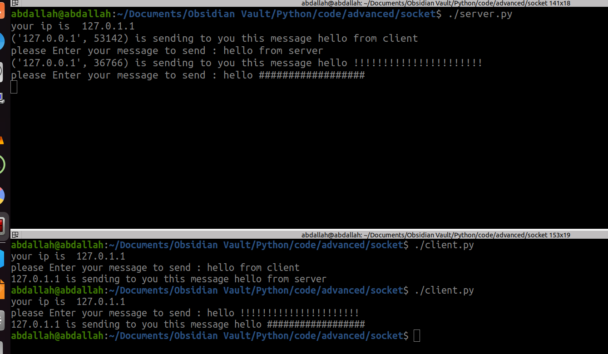

## How Python Interpreter Works?


## How to Run interpreting ? 

```
$ python3 intro.py
```
or by using shebang


## comments 
1-
(# this is a single line comment)
2- 
'''
this 
is 
a multi 
line 
comment 
'''

## string
```python
print("hello world") # hello world
print('hello world') # hello world
print('hello "worldr" ') # hello "worldr"
print("hello 'world' ") # hello 'world'
print("Name : Abdallah Ahmed ",end=",")
print("Age : 23") # Name : Abdallah Ahmed ,Age : 23
```
## Variables

```python
x = 5
print(x) # 5
print(type(x)) # <class 'int'>

x = 5.5
print(x) # 5.5
print(type(x)) # <class 'float'>

x="Abdallah"
print(x) # Abdallah
print(type(x)) # <class 'str'>
```
## Data Types


### complex number 
```python
# complex number
x=5+6j
print(x) # (5+6j)
print(type(x)) # <class 'complex'>
print(x.real) # 5.0
print(x.imag) # 6.0
```
### boolean
```python
print(bool(True)) #True
print(bool(False)) #False
print(bool(None)) #False
print(bool(0)) #False
print(bool("")) #False empty string
print(bool(())) #False empty tuple
print(bool([])) #False empty list
print(bool({})) #False empty set
```
### List
```python
#Collection - ordered - mutable(changed)
ls=[1,2,3,4,5,6,7,8,9]
print(ls) #[1, 2, 3, 4, 5, 6, 7, 8, 9]
ls[1] = 50
print(ls[1]) #50
print(ls[1:5]) #[50, 3, 4, 5]
print(ls[1:6:2]) #[50, 4, 6]
print(ls[-1]) #9
print(ls[::-1]) #[9, 8, 7, 6, 5, 4, 3, 50, 1]
print(ls[2:]) #[3, 4, 5, 6, 7, 8, 9]
ls=[1,2,3,4,5,"Abdallah",50.5]
print(ls) #[1, 2, 3, 4, 5, 'Abdallah', 50.5]
```
### Tuple
```python
#Collection ordered unchangeable (Immutable)
t=(1,2,3,4,5,6,7,8,9)
print(t) #(1, 2, 3, 4, 5, 6, 7, 8, 9)
#t[1] = 50 error
print(t[1:5]) #(2, 3, 4, 5)
print(t[1:6:2]) #(2, 4, 6)
print(t[-1]) #9
print(t[::-1]) #(9, 8, 7, 6, 5, 4, 3, 2, 1)
print(t[2:]) #(3, 4, 5, 6, 7, 8, 9)
t=(1,2,3,4,5,"Abdallah",50.5)
print(t) #(1, 2, 3, 4, 5, 'Abdallah', 50.5)
```
### Dictionary
```python
dic={
"Name": "Abdallah",
"Age": 23,
"BirthDate": "17/12/2000",
"Grade": ["A+","A", "B+", "B"]
}
print(type(dic)) #<class 'dict'>
print(dic) 
#{'Name': 'Abdallah', 'Age': 23, 'BirthDate': '17/12/2000', 'Grade': ['A+', 'A', 'B+', 'B']}

print(dic.keys()) # dict_keys(['Name', 'Age', 'BirthDate', 'Grade'])
print(dic.values()) 
# dict_values(['Abdallah', 23, '17/12/2000', ['A+', 'A', 'B+', 'B']])

print(dic["Age"]) #23
print(len(dic)) #4
```

### Set
```python
# items are unordered, changeable(mutable), and do not allow duplicate values.

Set = {"Abdallah","Omar","Hossam"}
print(Set) #{'Omar', 'Hossam', 'Abdallah'}
print(type(Set)) #<class 'set'>
```


*************


[list , Dictionary , Tuples and Sets]

## Range
```python
print(range(10)) #range(0, 10)
print(list(range(10))) #[0, 1, 2, 3, 4, 5, 6, 7, 8, 9]
print(list(range(0,10,2))) #[0, 2, 4, 6, 8]
#print(list(range(0,10,1.5))) # error the increment must be integer
```

## input 
```python
name = input("Please enter Your name ")
print(f"Your name is {name}")
print("Your name is {}" .format(name))
print(f"Your name is " , name)
print(f"Your name is {name}")
Age = input("Please enter your age ")
print("your age is ",str(Age))
```

## operators


## if statement
```python
x,y,z=20,30,12
if z>x and z>y:
	print("z is bigger than x and y")
elif x>z and x>y:
	print("x is bigger than y and z")
else:
	print("y is bigger than x and z")

  

# Shorthand If ... Else
a=20
b=50

print("A") if a>b else print("=") if a == b else print("B")

if a>b:
	print("A")
else:
	if a ==b :
		print("=")
	else:
		print("B")

  
# pass Statement
if 10 >20 :
	pass
```

## loop
```python

i=5
while i < 10:
	print(i)
	i+=1
#############################
for i in range(10):
	if i %2 ==0:
		continue
	else:
		print(i,"odd")
#############################
# Else in For Loop
for i in range (10):
	print(i)
 else:
	print("Finally finished") # it will printed in any case
#############################
# Nested Loops
adj = ["red","big","testy"]
fruits = ["apple","banana","cherry"]
for x in adj:
	for y in fruits:
		print(x,y)
```

## Function


```python
#1 normal function (void , return )
def say_hello():
	print("Hello")
say_hello()


import random
def ret_random():
	return random.randint(0, 100)
print(ret_random())

```
```
# 2.Value(assign , default)

def test_function(value1,value2,value3=100):
	print("Value1 is ",value1 , " and Value2 is ",value2 , " and Value3 is ",value3)

  

test_function(10,20,30)
test_function(10,20)
```

```python
#3. variadic arguments(*list,**dict)

def my_function(*args):
	for i in args:
		print(i,end=",")
	print("")

my_function("Abdallah","Ahmed","Ali")
my_function(1,2,3,4)

def my_function2(**args):
	print(args.keys())
	print(args.values())
	ls=[]
	for i in args:
		 ls.append(i)
	for i in ls:
		 print(args[i])
my_function2(Key1=10,Key2=20)
```


## pass by reference & pass by value 
```python
# pass by value

def pass_py_value(value):
	value = 10
	print(value) #10
	print(id(value)) # 140403803275792 --> different addresse

  

value=20
print(value) #20
print(id(value)) #140403803276112 --> some address
pass_py_value(value)
print(value) #20
print(id(value)) #140403803276112 --> same address

  

print("=============")


# pass by reference

def pass_py_value(value):
	value[0] = 10
	print(value) #10
	print(id(value)) # 140403804276416 --> same addresse
 
value=[20] # make it list
print(value) #20
print(id(value)) #140403804276416 --> some address
pass_py_value(value)
print(value) #10 --> changed
print(id(value)) #140403804276416 --> same address
```

## deep copy and shallow copy


## class


### inheritance in class


### private & static


### operator overloading


```python
  

class Rectangle:
	def __init__(self, width, height):
	self.width = width
	self.height = height
def __eq__(self, other):
	return self.width == other.width and self.height == other.height
def __ne__(self, other):
	return not self.__eq__(other)
def __lt__(self, other):
	return self.area() < other.area()
def __gt__(self, other):
	return self.area() > other.area()
def __le__(self, other):
	return self.area() <= other.area()
def __ge__(self, other):
	return self.area() >= other.area()
def area(self):
	return self.width * self.height

  

# Creating rectangles
rect1 = Rectangle(4, 5)
rect2 = Rectangle(3, 6)
rect3 = Rectangle(4, 5)


# Equality comparison
print(rect1 == rect2) # Output: False
print(rect1 == rect3) # Output: True
# Inequality comparison
print(rect1 != rect2) # Output: True
print(rect1 != rect3) # Output: False
# Less than comparison
print(rect1 < rect2) # Output: False
print(rect2 < rect3) # Output: True
# Greater than comparison
print(rect1 > rect2) # Output: True
print(rect2 > rect3) # Output: False  
# Less than or equal to comparison
print(rect1 <= rect2) # Output: False
print(rect2 <= rect3) # Output: True
# Greater than or equal to comparison
print(rect1 >= rect2) # Output: True
print(rect2 >= rect3) # Output: True
```

## file operations


'r' open for reading (default)
'w' open for writing, truncating the file first
'x' create a new file and open it for writing
'a' open for writing, appending to the end of the file if it exists
'b' binary mode
't' text mode (default)
'+' open a disk file for updating (reading and writing)
'U' universal newline mode (deprecated)

```python
fd = open("text.txt","r")
print(fd.read())
print(fd.read()) 
#empty becaus at the last time the cursor was at the end of the last line
fd.close()
fd = open("text.txt","a")
fd.write("hello world adding new line\n")
fd.close()
```

```python
with open("text.txt") as f:
	print(f.read())
fd = open("text.txt","r")
x = fd.readlines()
fd.close()
for i in x:
	print(i)
```


```python
#Quick tasks
#1.Write a Python program to count the number of lines in a text file.
fd = open("text.txt","r")
x = fd.readlines()
print(len(x))
fd.close()

#2.write a Python program to count the Number of words in a file.
fd = open("text.txt","r")
x = fd.read().split()
print(len(x))
fd.close()

  
#3.Write a Python program to write a “list” to a file.
ls = ['hello','this','is','a','simple','exampe']
fd = open("text.txt","a")
text = " ".join(ls)
fd.write(text)
fd.close()
```

## excel sheet


## exceptions handling
```python
# Try /except/else/finally
try:
	print(5)
except:
	print("something is wrong")
 else:
	print("everything is okay")
finally:
	print("this will executed in any case")

  

try:
	print(1/0)
except NameError:
	print("NameError: name 'x' is not defined")
except ZeroDivisionError:
	print("ZeroDivisionError: division by zero")
```

## Threading


## Socket programming





## GUI


### position 

### 1. pack()


### 2.grid()


### 3.place()


### we can mix between them 


### Widget_function
### 1.label
### 2.Button

### Quick task


### 3.Entry
### Login project


### Task 3
### Write a program that asks the user to type a word and return him its reverse
  


### 4.List box


## 5.Radio Button


### Quick Task
### Create a graphical application in Python Tkinter that asks the user to enter two integers and displays their sum


### 6.checkbox


### 7.scale


### 8.Text Widget


### New Form


### Task
```python
#!/usr/bin/python

from tkinter import *
root = Tk()
root.title("test")
root.geometry("350x350+1000+100")
root.resizable(False,False)
myCanvas = Canvas(root)
myCanvas.pack()

#functions 
def create_circle(x, y, r, canvas): #center coordinates, radius
    x0 = x - r
    y0 = y - r
    x1 = x + r
    y1 = y + r
    return canvas.create_oval(x0, y0, x1, y1,fill="white")

def button_callback(value):
    print("Button value: Led", value)
    if value == "ON":
        myCanvas.itemconfig(circle_id, fill="red")
    elif value == "OFF":
        myCanvas.itemconfig(circle_id, fill="white")
    else :
        pass


#Handles
circle_id = create_circle(150, 150, 40, myCanvas)
b1 = Button(root, text="Led ON", width=20, command=lambda: button_callback("ON"))
b2 = Button(root, text="Led OFF", width=20, command=lambda: button_callback("OFF"))


#Placing
b1.place(x=70,y=200)
b2.place(x=70,y=240)

root.mainloop()
```


