## why we implement the copy constructor ?

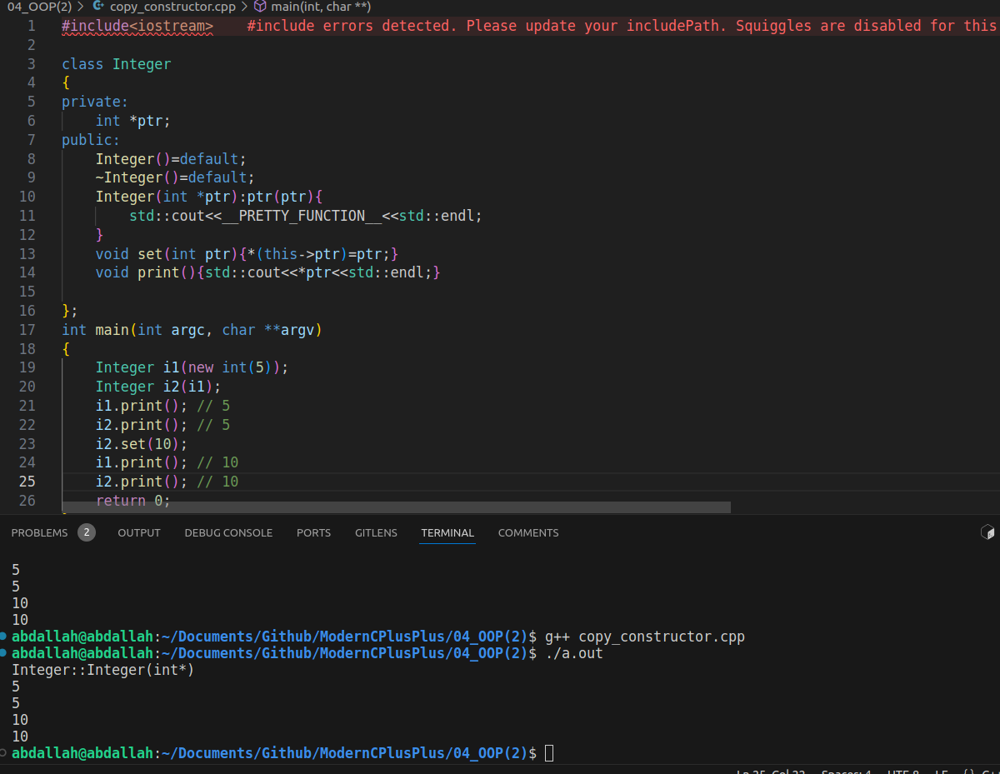

the compiler by default generate the copy constructor and do the shallow copy , this mean any update in first object will updated also in the second one and vice versa
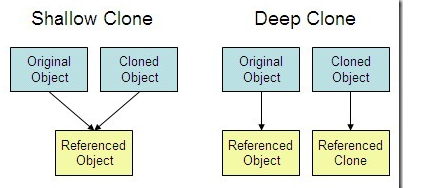

### to solve this problem we must implement the copy constructor 

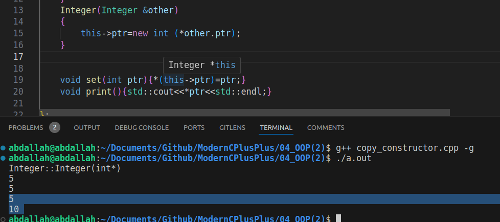
### it work and the deep copy achieved
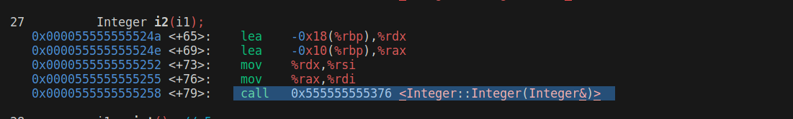

## the copy constructor implemented as Classname (const Classname &obj)
what if we remove the (&) and remove the const from it ?

if we remove the reference it will give an error because an infinite recursive calling of the copy constructor will happen .
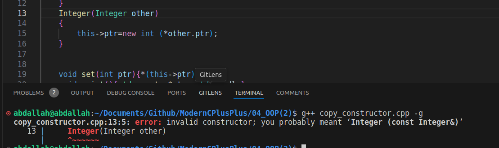

if we remove the const from it , it will work but when we trying to return an  object from function it will give an error , because it create a temporary object before return and then return this temporary .
note that in c++17 the compiler make optimization to resolve this issue.
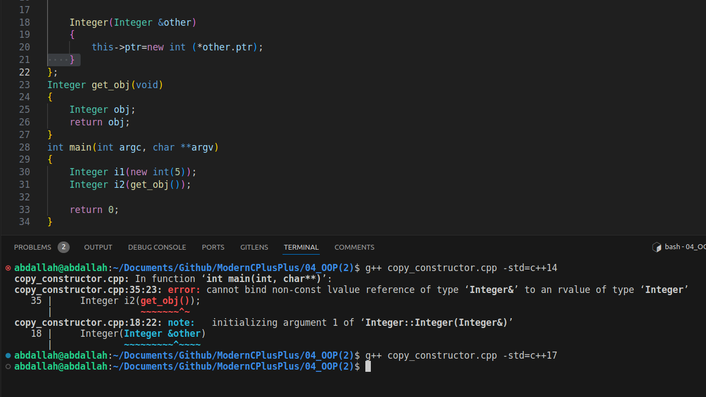


### it work now 
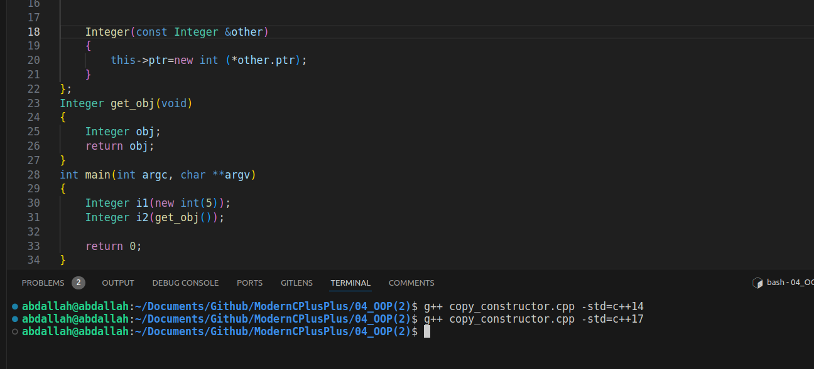


## what exactly happen in the return ?
by setting this flag -fno-elide-constructors we see that the copy constructor called twice why ?
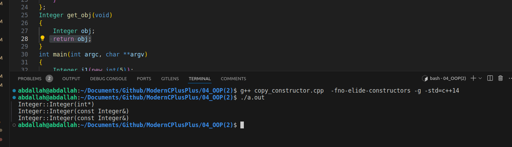

the compiler typically creates a temporary object to hold the return value. Then, this temporary object is used to initialize the object in the calling function (in this case, the `main` function). This process is known as copy initialization.
here the in the return line , the copy constructor is called 
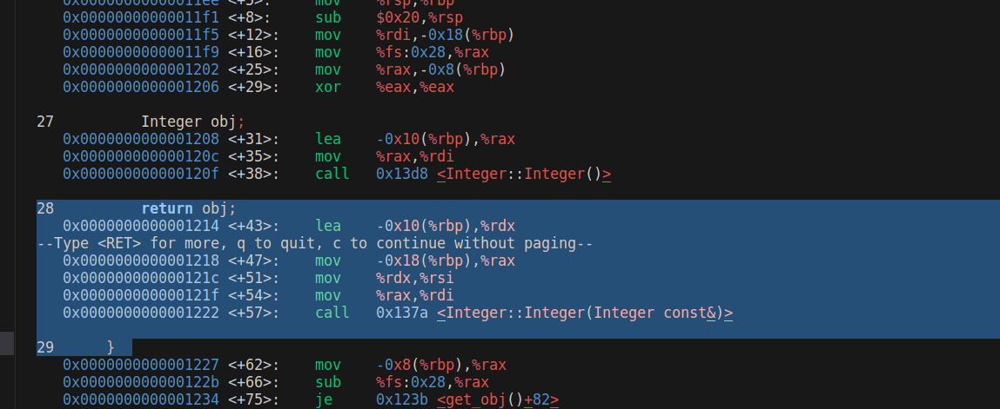
and in the calling line the copy constructor is called also 
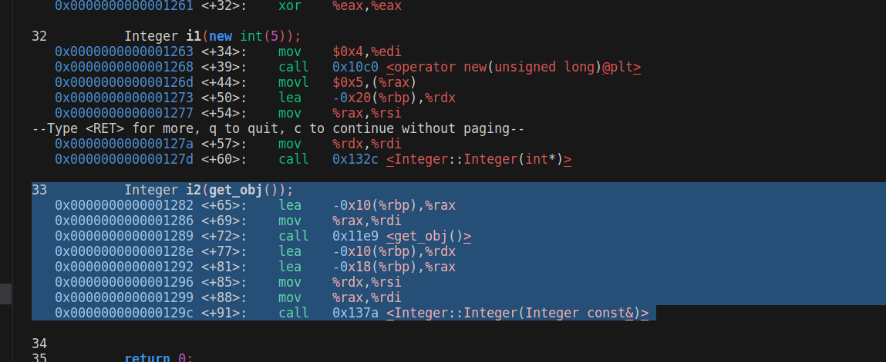

**return value optimization** (**RVO**) is a compiler optimization  that involves eliminating the temporary object  created to hold a function's return value.

Copy elision is an optimization technique employed by compilers to avoid unnecessary object copies. It allows the compiler to optimize away the copy constructor calls in certain cases, resulting in improved performance.
In some cases, the compiler may elide the copy constructor calls altogether and construct the object directly in the memory allocated by the caller function. This optimization eliminates the need for the copy constructor to be called twice.

### what is the  Resource acquisition is initialization (RAII) ?
RAII stands for Resource Acquisition Is Initialization. It is a C++ programming technique that ensures that resources (such as memory, file handles, network connections, etc.) are acquired and released in a deterministic and exception-safe manner.

in the above example if we see is there any memory leakage or not ?

runinng this command 
```shell
valgrind valgrind --leak-check=full --show-leak-kinds=all ./a.out
```
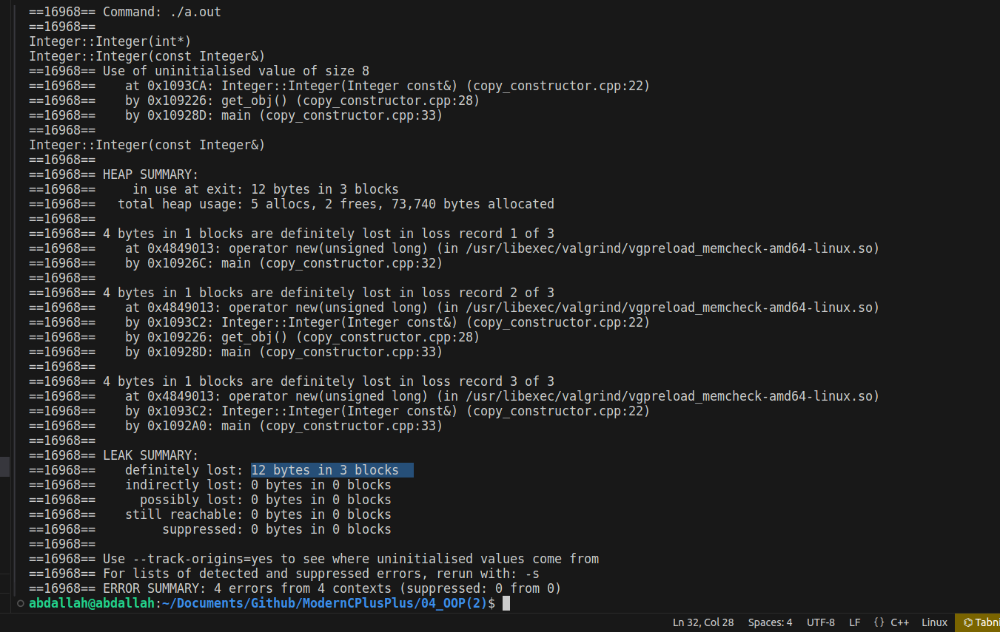


there is 12 bytes leakage why ?
there are  three objects form the class Integer (4*3 = 12 byte ) alocated without releasing   
if we implement the destructor to release these pointers in the heap section , there is no lekeage

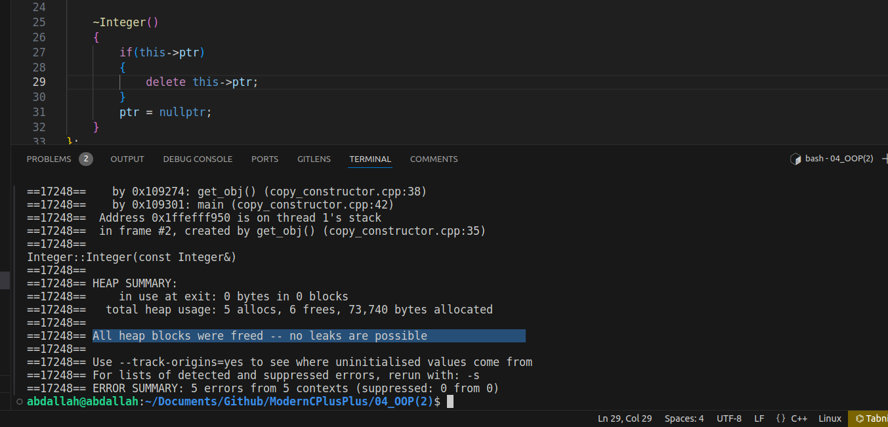

### Operator = copy overload
if we assign i2 like this (i2=i1) the operator = overloading will be called , same problem (shallow copy ) and double free to ptr pointer because the same pointer we try to release it .
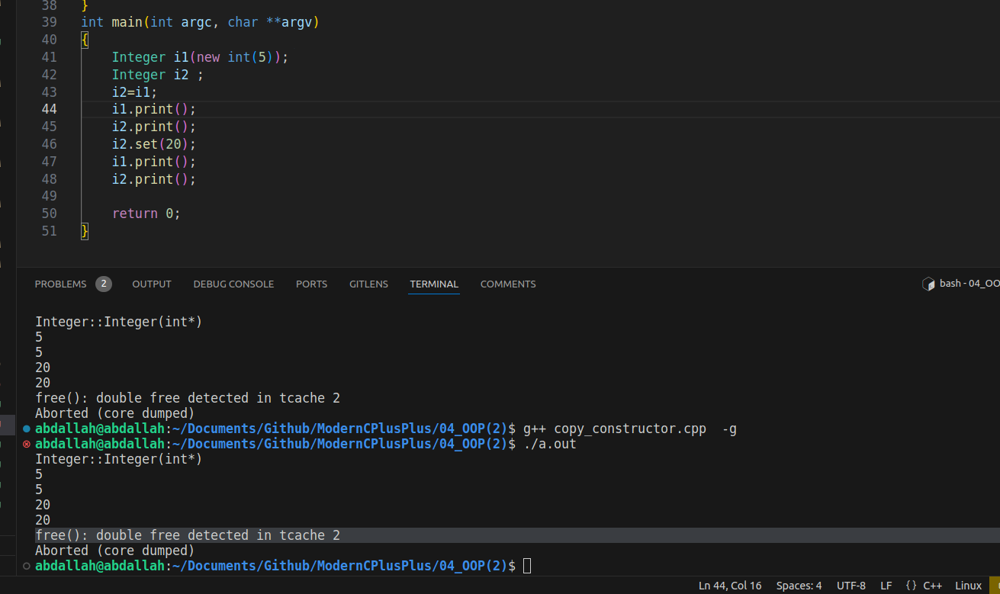
to resolve this problem we will implement the operator = overloading
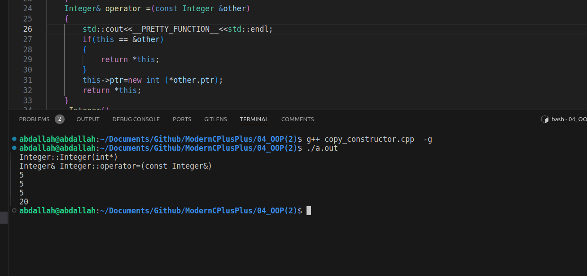

## note that if we assign the object with other during the initialization --> copy constructor
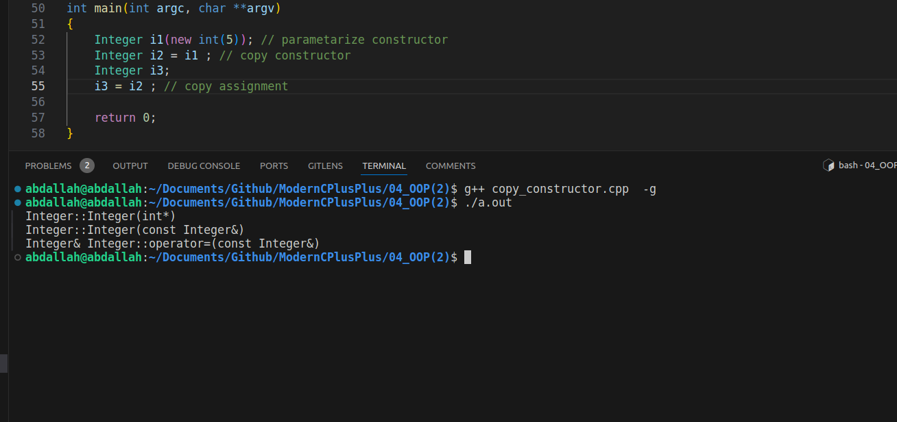
