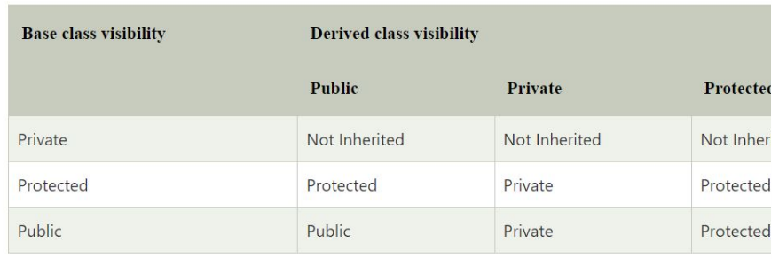
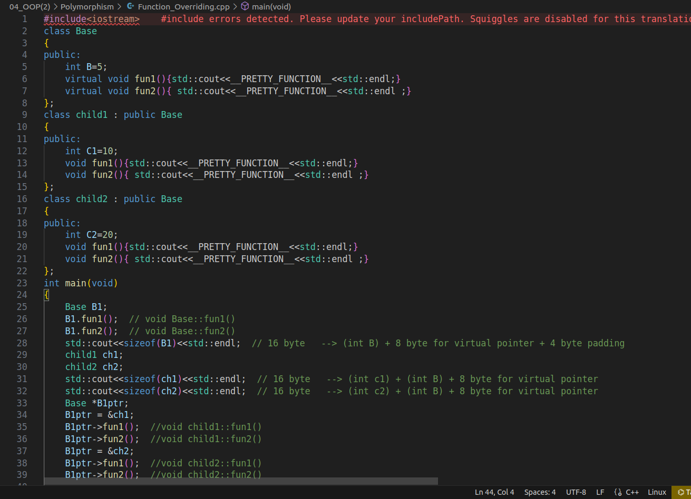

## inheritance
The idea of inheritance implements the is a relationship 

## Types of inheritance

## **1. Single Inheritance**

When a derived class inherits only from one base class, it is known as single inheritance

## **2. Multiple Inheritance**

When a derived class inherits from multiple base classes it is known as multiple inheritance

## **3. Hierarchical inheritance**

When more than one derived classes are created from a single base class , it is known as Hierarchical inheritance.

## **4. Multilevel Inheritance**

The transitive nature of inheritance is itself reflected by this form of inheritance. When a class is derived from a class which is a derived class – then it is referred to as multilevel inheritance.

## **5. Hybrid inheritance**

When there is a combination of more than one type of inheritance, it is known as hybrid inheritance. Hence, it may be a combination of Multilevel and Multiple inheritance or Hierarchical and Multilevel inheritance or Hierarchical, Multilevel and Multiple inheritance.

## visibility of inherited members

## Function Overriding

## without virtual

## with virtual

### when we declare the function as a virtual , the compiler generate an extra member called virtual pointer that point to the virtual table  (array of pointers)  , this table contain the entry point of every virtual function  

### this virtual pointer point to the virtual table 

### the first index in the virtual table is pointer to the fun1() in the Base class

### the second index of this table point to fun2()  in the Base class

### In dynamic polymorphism, when a child1 class inherits from a base class (`Base`), it also inherits the virtual pointer from the base class. However, during runtime, this virtual pointer is assigned a new value to point to the virtual table specific to the `Child1` class, rather than the virtual table of the base class.

### Similarly, when the other class child2 inherits from the same base class (`Base`), it also has its own virtual table. During runtime, the virtual pointer of `Child2` is assigned a value to point to its specific virtual table.

### In summary, each class that participates in dynamic polymorphism has its own virtual table. When a class inherits from a base class, it also inherits the virtual pointer, which is then assigned a value to point to the virtual table specific to that class during runtime.
### in this picture every derived class inherit the virtual pointer of the base class (\_vptr.Base) but it assigned to different value (the start location of the virtual table of the derived class).

### Linked in post 
🔎 Understanding the Basics:  
In C++, the concept of virtual functions allows us to achieve runtime polymorphism, where the appropriate function is called based on the actual object type rather than the declared type. This enables us to write more flexible and extensible code.  
  
⚙️ The Virtual Table:  
At the heart of the virtual mechanism lies the virtual table, also known as the vtable or virtual function table. Each class that contains at least one virtual function has its own virtual table. This table is essentially an array of function pointers, pointing to the virtual functions of the class.  
  
🔗 The Virtual Pointer:  
To make use of the virtual table, a special member called the virtual pointer (vptr) is added to each object of a class with virtual functions. The vptr points to the virtual table of that particular class. When a virtual function is called through a base class pointer or reference, the vptr is used to determine the correct function to invoke.  
  
🚀 Behind the Scenes:  
1️⃣When the compiler compile this class it will generate an array of function pointers (virtual table) that contain the addresses of virtual functions .  
2️⃣The starting address of this virtual table will store in a special member variable called virtual pointer.  
3️⃣This pointer automatically added by the compiler as a member of the class.  
4️⃣When the derived class inherit from the base class , the compiler will generate a virtual table for the derived class, and the virtual pointer will inherited and it will be initialized with the address of the virtual table of the derived class.
🔒 Benefits of Virtual Mechanism:  
1️⃣ Dynamic Polymorphism: With virtual functions and the virtual table, C++ enables objects to exhibit different behaviors based on their actual type, allowing for cleaner and more adaptable code.  
2️⃣ Extensibility: The virtual mechanism allows you to easily add new derived classes without modifying existing code, promoting code reuse and scalability.  
3️⃣ Run-time Flexibility: The determination of the function to be called happens at runtime, enhancing flexibility and adaptability in complex systems.

