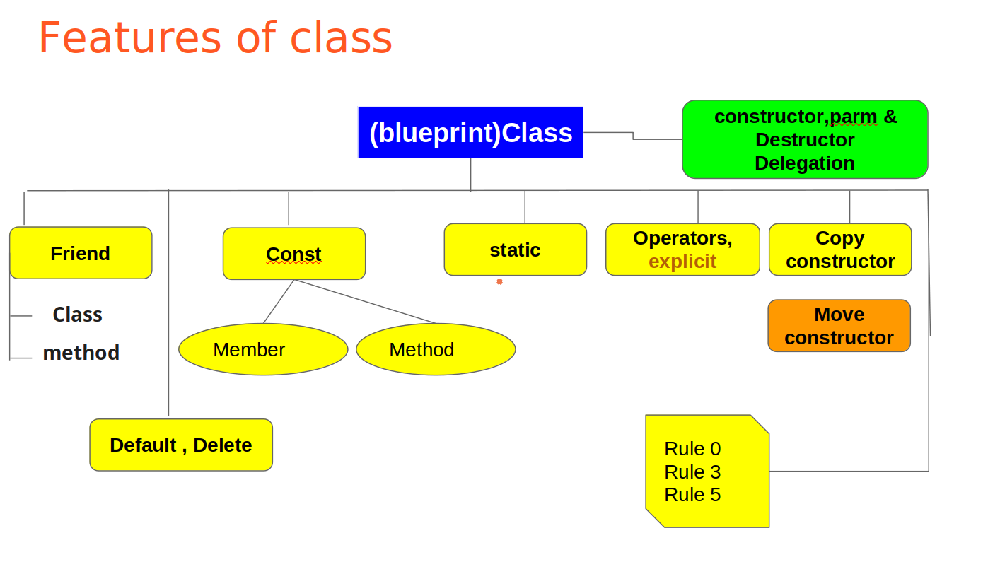
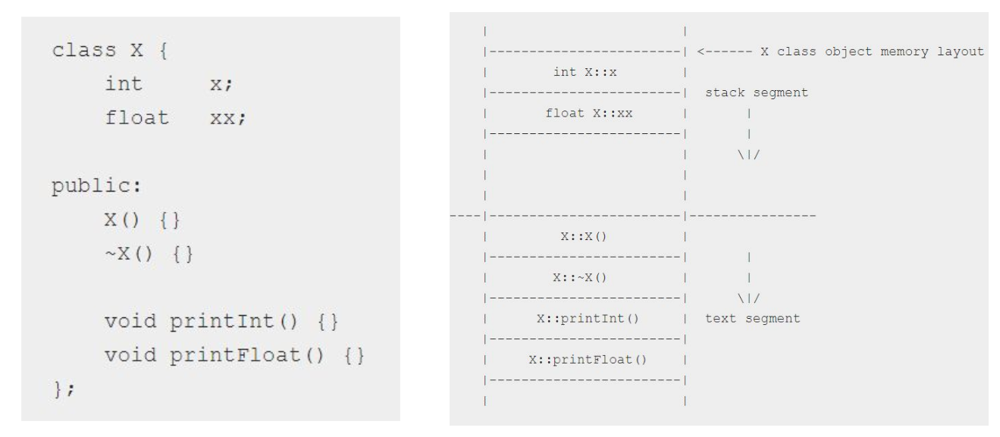
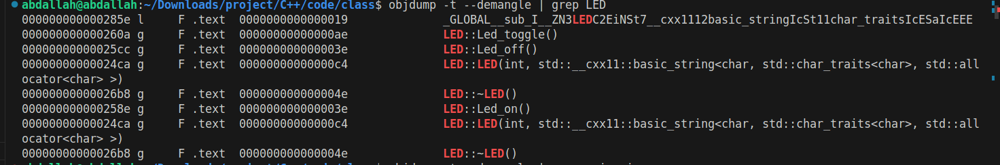
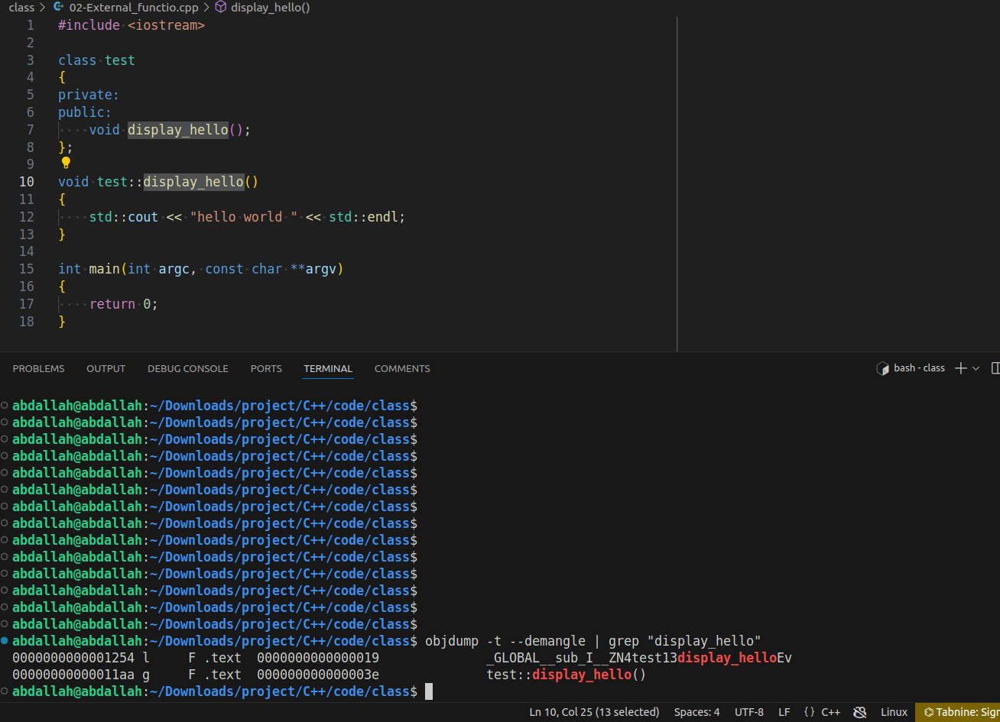
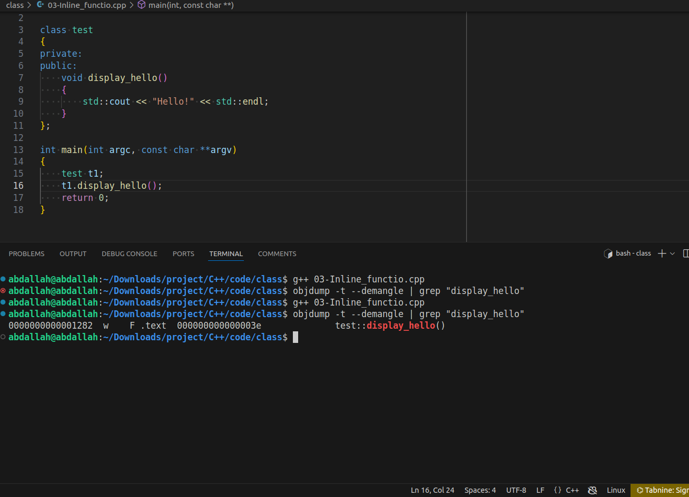

### Encapsulation
class contain methods and varianles
```cpp
#include <iostream>
#include <thread> // std::this_thread::sleep_for
#include <chrono> // std::chrono::seconds, std::chrono::milliseconds
constexpr int DELAY = 1;

class LED
{
private:
	int gpio_pin;
	std::string direction;
public:
	LED() = delete; 
    LED(int gpio_pin, std::string direction);
	void Led_on();
	void Led_off();
	void Led_toggle();
	~LED();
};

LED::LED(int gpio_pin, std::string direction) : gpio_pin(gpio_pin), direction(direction)
{
 	// initialize the gpio_pin as output or input
	std::cout << "Pin " << gpio_pin << " initialized as " << direction << std::endl;
}
void LED::Led_on()
{
	// write on to /sys/class/gpio/${gpio_pin}/value one
	std::cout << "Led is on" << std::endl;
}
void LED::Led_off()
{
	// write on to /sys/class/gpio/${gpio_pin}/value zero
	 std::cout << "Led is off" << std::endl;
}
void LED::Led_toggle()
{
	// on
	std::cout << "Led is on" << std::endl;
	 // delay
	 std::this_thread::sleep_for(std::chrono::seconds(DELAY));
	// off
	std::cout << "Led is off" << std::endl;
}
LED::~LED()
{
	std::cout << "the gpio_pin is free" << std::endl;
}
 int main(int argc, const char **argv)
{
	LED led1{12, "out"};
	led1.Led_toggle();
	return 0;
}
```


### memory layout



### symbole table


### External vs inline function
we can define the function internal or external 
 in the case of definition external , if we use it or not , it will not optimized (removed)
 

 inline function 
 if we use it it will not optimized but if we doesn't use it , it will removed 
 

### initializer list

