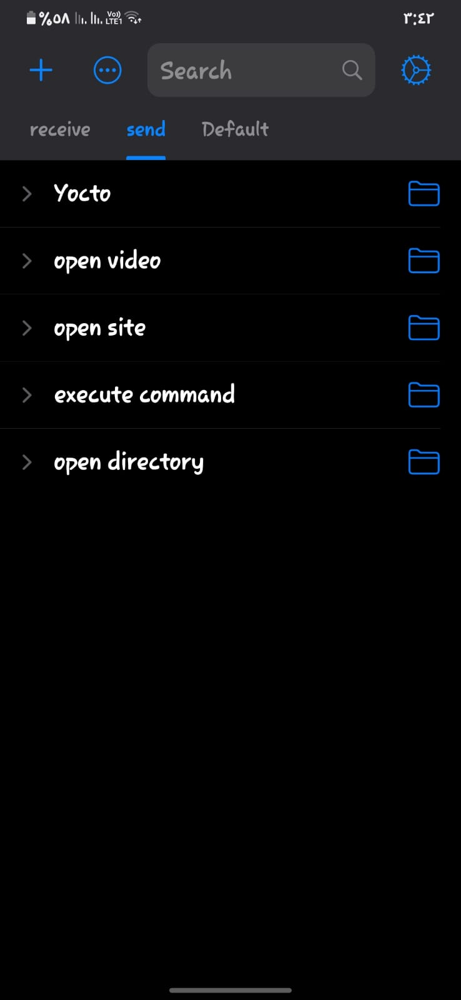
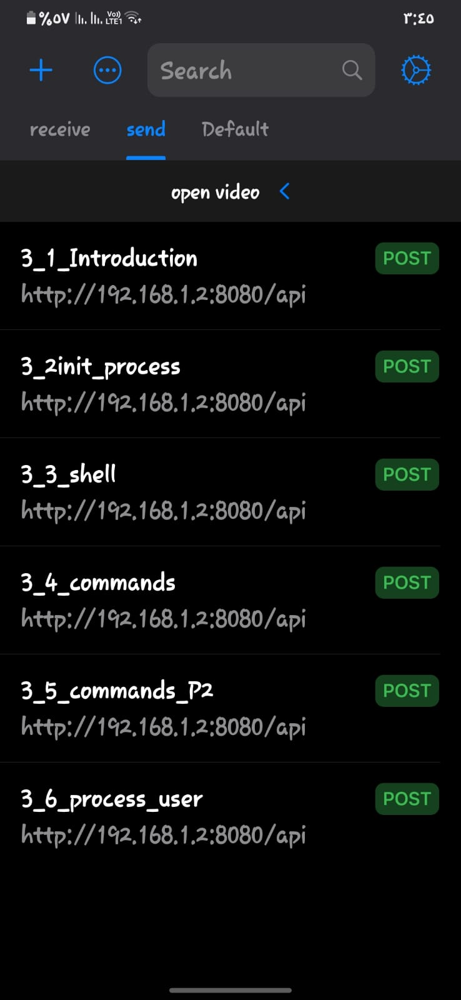
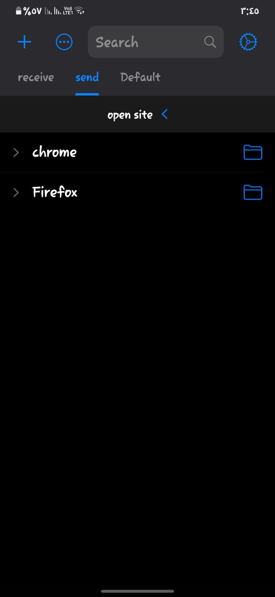
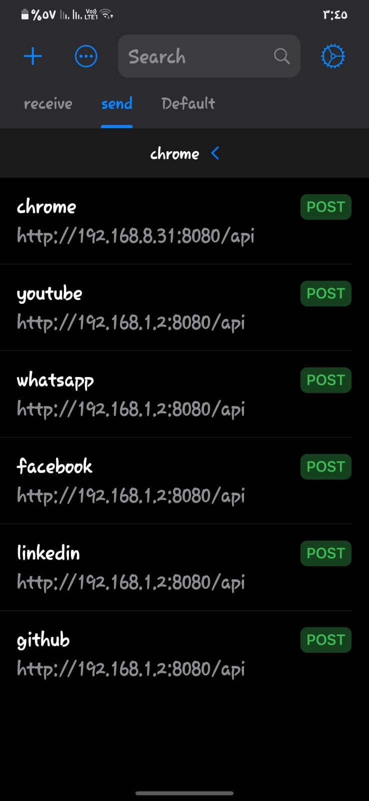
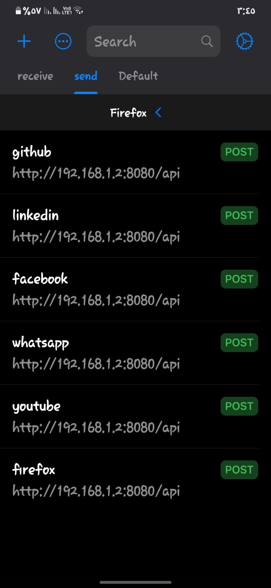
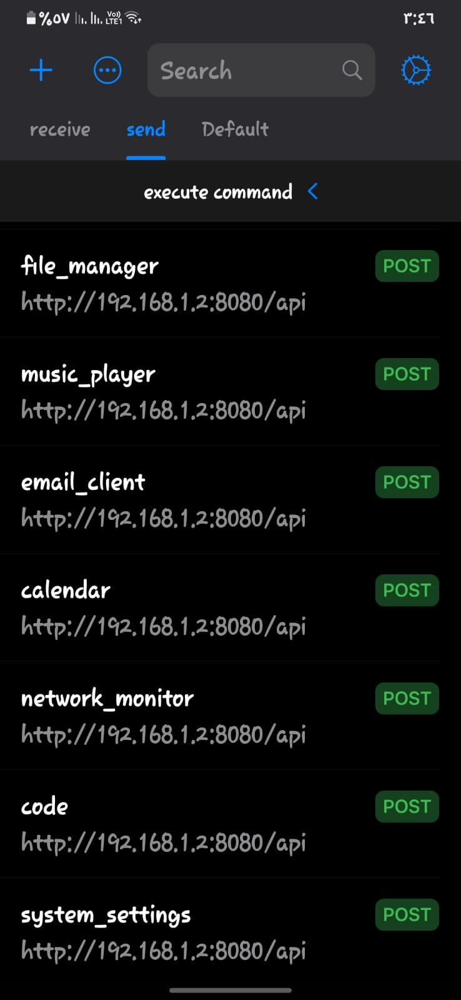
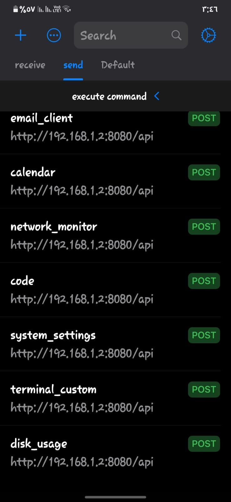
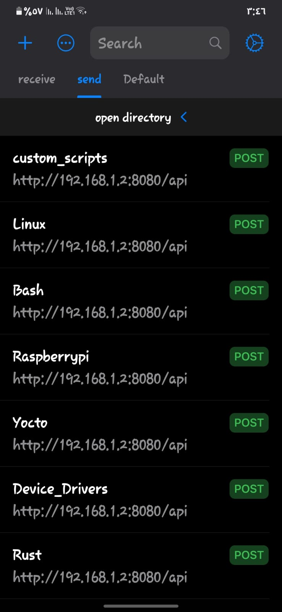
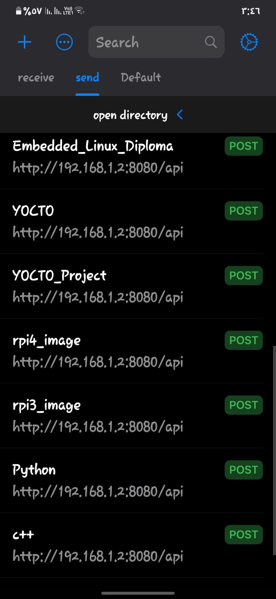

## PC Control project 

This project features a C++ server application that enables sending requests from a phone to the PC to execute specified job.

Additionally, the application returns the status of each request, indicating success. The mobile app can also request information about the PC, such as battery status, running processes, and more.

### the mobile app 
the application contain two main collection one for send and the other for receiving

### 1.for the send collection 
it contain five folders 
1.Yocro this will contain any command related to the yocto project.
2.open video we can add the most played video to open it with the project 
in this example i just add one topic related to Linux commands .
3.open site you can open any site exist in this folder and you have two option to open it from Firefox , google chrome.
4.execute commands this will contain the other commands like opening calculator , camera , calendar , and so on .
5.open directory to open specific folder 

### 1. Yocto folder

### 2. Open video folder

### 3. Open site folder

### you can chose Firefox or google chrome

### 4.execute command folder

### 5.Open directory folder

### the next collection is receive 

