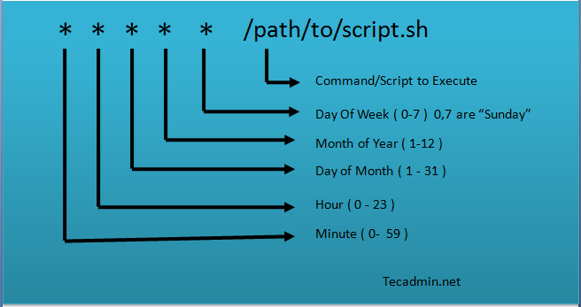

## What is Linux?
Open source operating system , Created by Linus Torvalds in 1991 .
## Features of Linux
Open Source , Portability , Multi-User and Multi-Tasking , Networking , Security.
## Embedded Linux
Embedded Linux  is the customization of Linux on Embedded target.
## Main Components to Build Linux 
Toolchain , Bootloader , Kernel , Rootfs
## Booting Sequence
## The boot sequence:
## 1.PC
### 1.BIOS:
1- POST
	1- initial HW Drivers [screen, keyboard]
	2-check HW Functionality
	3-check portable device
	4-check short circuit 
2-LOAD (MBR/GPT)
### 2.MBR (Master Boot Record):
Located in the 1st sector of the bootable disk.
Responsible for loading and executing the GRUB boot loader.
Contains information about GRUB or LILO (in older systems).


### 3.GRUB (GNU GRand Unified Bootloader):
The typical boot loader for modern Linux systems.
Displays a splash screen with a menu for selecting boot options.
Loads and executes the selected kernel image.
Uses the grub.conf (or grub.cfg) configuration file.

### 4.Kernel:
1- Load Device Drivers( Printer , GPIO , Network,etc)
2-memory initializations (RAM)
3-run init process
4- run user process

### 5.Init:
Executes runlevel programs based on the chosen run level.
Historic systems use /etc/inittab, while modern systems use systemd.
#### Run level 0 is matched by poweroff.target (and runlevel0.target is a symbolic link to poweroff.target).
#### Run level 1 is matched by rescue.target (and runlevel1.target is a symbolic link to rescue.target).
#### Run level 3 is emulated by multi-user.target (and runlevel3.target is a symbolic link to multi-user.target).
#### Run level 5 is emulated by graphical.target (and runlevel5.target is a symbolic link to graphical.target).
#### Run level 6 is emulated by reboot.target (and runlevel6.target is a symbolic link to reboot.target).
#### Emergency is matched by emergency.target.
### 6.Runlevel Programs:
Different services start depending on the run level.
Located in directories specific to each run level.
Programs starting with "S" or "K" for startup and kill, respectively.
These are known as runlevel programs, and are executed from different directories depending on your run level.
Each of the 6 runlevels described above has its own directory:
#### Run level 0 – /etc/rc0.d/
#### Run level 1 – /etc/rc1.d/
#### Run level 2  – /etc/rc2.d/
#### Run level 3  – /etc/rc3.d/
#### Run level 4 – /etc/rc4.d/
#### Run level 5 – /etc/rc5.d/
#### Run level 6 – /etc/rc6.d/

##  initramfs (InitRamfs not Mandatory for some devices/ if it is not exit so kernel will mount rootfs directly)
An **initramfs** (**init**ial **ram** **f**ile **s**ystem) is used to prepare Linux systems during boot before the **init** process starts.

The initramfs usually takes care of mounting important file systems (by loading the proper kernel modules and drivers) such as /usr or /var, preparing the /dev file structure, etc.


## The raspberry pi boot sequence:

1. BCM2837 powers on, arm core off, and GPU is on.
2. GPU executes first stage bootloader found in the ROM. The first stage bootloader allows GPU access to SD Card.
3. GPU reads from SD Card loads the second stage bootloader(bootcode.bin) into L2 cache. bootcode.bin enables the SDRAM. 
Afterwards, the GPU reads and executes the GPU firmware(start*.elf files).
4. Start.elf reads kernel.img, config.txt, and cmdline.txt and loads them into memory. The GPU wakes up the ARM CPU.
5. Kernel is booted up.


## The beaglebone black boot sequence :

## Phases boot sequence inside Bootloaders.

### 1.Phase 1 – ROM code
Phase 1 or ROM code is a crucial part of a chip's start-up process.
It's preloaded during manufacturing and can't be changed. 
This code doesn't handle memory setup but uses a small on-chip memory (SRAM) 
to load a tiny portion of code from preset locations,like specific flash memory pages or files. 
Most SoCs follow a similar process, and if the SRAM is too small for a full bootloader, an interim loader (SPL) steps in.
### At the end of the ROM code phase, the SPL is present in the SRAM and the ROM code jumps to the beginning of that code.

### 2.Phase 2 – secondary program loader
Phase 2, also known as the secondary program loader (SPL), prepares the system for the next step by setting up 
critical components like the memory controller before loading the Tertiary Program Loader (TPL) into DRAM. 
If the SPL has filesystem drivers built in to it, it can read wellknown filenames, such as u-boot.img from a disk partition.
This phase involves the transition from ROM code to SPL, where the SPL, functioning in SRAM, loads the TPL into DRAM. 
By the end of this phase, the TPL is in DRAM, and the SPL initiates a jump to that area. 
### Phase 3 – TPL
the Tertiary Program Loader (TPL), introduces a full bootloader like U-Boot. It provides a simple command-line interface 
for tasks such as managing boot and kernel images in flash storage and facilitating kernel loading and booting, both manually and automatically.
This phase show the jump from SPL in SRAM to TPL in DRAM .As the TPL executes, it loads the kernel into DRAM. 
At the end of the third phase, there is a kernel in memory, waiting to be started


## Folder Structur


## Tasks
### 1.resolv.conf   -->  **/etc/resolv.conf**
  
The `resolv.conf` file is a configuration file used by Unix-like operating systems to configure the Domain Name System (DNS) resolver library. The DNS resolver library is responsible for resolving domain names to IP addresses, allowing applications to connect to remote servers using human-readable domain names rather than numerical IP addresses.
**nameserver:** Common entries include the "nameserver" directive followed by the IP addresses of DNS servers. For example:
**nameserver 8.8.8.8**
**nameserver 8.8.4.4**
In this example, the system is configured to use the Google Public DNS servers.
**Search Domains:** The `resolv.conf` file may also include a "search" directive, specifying a domain search list. This list is used by the resolver to append domain names to incomplete hostnames, allowing users to use short, unqualified names when specifying hosts.
**search example.com mycompany.local**
In this case, if a user enters a single-word hostname like "server," the resolver will try appending the domains "example.com" and "mycompany.local" to find the complete domain name.
In this case, if a user enters a single-word hostname like "server," the resolver will first try to resolve "server.example.com" and then "server.mycompany.local."
**Options:** Additional configuration options can be included in the `resolv.conf` file, specifying various behaviors and settings for the DNS resolver.


### 2.fstab

  
The `/etc/fstab` file, short for File System Table, is a configuration file on Unix-like operating systems that defines how disk drives and partitions should be mounted and integrated into the file system during the system boot process. The information in the `fstab` file determines where each partition is mounted and with what options.
1. **File Format:**
    
    - The `fstab` file is a plain text file.
    - Each line in the file represents a separate file system mount point.
2. **Fields in Each Line:**
    
    - The `fstab` file typically contains six fields separated by tabs or spaces. The fields are as follows:
        1. **Device:** The device or partition to be mounted. This can be a device path (e.g., `/dev/sda1`) or a UUID (Universally Unique Identifier).
        2. **Mount Point:** The directory where the file system should be mounted.
        3. **File System Type:** The type of file system on the specified device (e.g., ext4, nfs, vfat).
        4. **Mount Options:** Options specifying how the file system should be mounted (e.g., read-only, read-write, permissions).
        5. **Dump:** Used by the dump backup utility. Typically set to 0 (zero) for regular file systems.
        6. **Pass:** Used by the fsck utility for filesystem consistency checks during boot. Typically set to 1 for the root file system and 2 for other filesystems.


**for example --> UUID=4b4e6b9e-8b5b-4d75-a538-8340de289122 / ext4 defaults 1 1**
file system mount point   type  options   dump  pass

UUID=0d361bdd-38f3-460f-8914-807bb0a34d3b  /     ext4    errors=remount-ro   0     1
file system -> UUID=0d361bdd-38f3-460f-8914-807bb0a34d3b
mount point --> /
type --> ext4
options -->errors=remount-ro
dump --> 0
pass --> 1


### 3-.bashrc,.bash_profile 
### Shell Startup --Login Shells
When the Login Shell starts up, it goes through these steps to set the proper environment
• System Wide Configurations
	• It reads /etc/profile for global configurations (for all users)
• User Specific Configurations
	• Then it reads one of the following for user specific extensions/overrides (if it finds one of the files starting from the first, it will read it and skip the rest)
	~/.bash-profile
	~/.bash-login
	~/.profile
	• Note that those files normally call ~/.bashrc internally
### Shell Startup – Non-Login Shells
Non-Login Shells build their environment as follows,
• First, they inherit the environment from their parent Login Shells
• On top of that, it reads the following configuration files,
• For Global settings they read the files:
	/etc/.bashrc
	/etc/bash.bashrc
• For user specific settings, they read,
	~/.bashrc

### 4.passwd,groups
The `passwd` command is used for changing a user's password. It allows users to set or modify their own passwords or, if used by a system administrator, to change the passwords of other users.
The `groups` command displays the groups to which a user belongs. It provides information about the group memberships of a specified user or, if no user is specified, the user who is currently logged in.

### 5.crontab
Process Types:-
1️⃣ Interactive Process :-
• The process is started by a user within a terminal and  controlled via that terminal.
• It is attached to its terminal, and will be killed if its terminal is closed.
• It is called interactive, cause it communicates with the user through the terminal.
• Examples:

$ ls
$ cat *.log | grep “error” | sort
$ echo "Hello world" > my-file
1️⃣ Automatic Process(batch process) :-
• This is a process that is not started directly by the user, instead, the user schedule it for a later start.
• It is not started inside a terminal (user does not even needs to be logged in when it starts).
• It is scheduled in one of the following ways,
a) Scheduled to run at a certain date and time (using the at command)  
example 
```shell
$at 01:35 < myscript.sh
```
at 1:35AM this  myscript.sh will run.
```shell
$at -l      #to List scheduled jobs
$at -r <n>	#Delete scheduled job <n>
```

b) Scheduled to run when system load is low (using the batch command).  
example  
```shell
$ batch < myscript.sh 
```

myscript.sh will run when the system load is low.
c) Scheduled to run periodically with certain periodicity or interval.
Cron Jobs:-
• Cron Jobs are those which are scheduled to run periodically.
crontab Files Format:-
• The crontab files have the following format , contains a line per scheduled job,Each line has three sections(Time Schedule Section,User Section,command to be executed).
### Example of job definition:
```shell
# Example of job definition:
# .---------------- minute (0 - 59)
# |  .------------- hour (0 - 23)
# |  |  .---------- day of month (1 - 31)
# |  |  |  .------- month (1 - 12) OR jan,feb,mar,apr ...
# |  |  |  |  .---- day of week (0 - 6) (Sunday=0 or 7) OR sun,mon,tue,wed,thu,fri,sat
# |  |  |  |  |
# *  *  *  *  * user-name command to be executed
```


example :- 
30 0 1 1,6,12 * root /home/abdallah/myscript.sh   this mean At 12:30 AM On First of Jan, June, Dec run myscript.sh
0 0 1,10,15 * * root /home/abdallah/myscript.sh   At Midnight on 1,10,15 on Every Month run myscript.sh
 */5 * * * * root /home/abdallah/myscript.sh 	  Every 5 Minutes run myscript.sh

======
To edit your user specific crontab file
$ crontab -e
To display your crontab file
$ crontab -l
To remove you crontab file
$ crontab -r


3️⃣ Daemon Process :-
• A Daemon process is a process that runs continuously in the background to perform a task, or waiting for services to be requested from it.
• A tradition is to have the daemon name ends with letter ‘d’ such as (syslogd,xinetd,ftpd,atd).
• A Daemon process often needs to have its parent as the init process (PPID = 1).
• Daemons are processes that run in the background and are detached from their controlling terminal. This means they cannot be managed directly from the terminal.
• Instead, there are scripts called init scripts that are used to manage daemons.
• Init scripts provide functionality to check the status, start, stop, and restart daemons.
• On many systems, these init scripts are located in the /etc/init.d directory.
• To manage a daemon, you can use the init script by running commands such as 
--> $sudo /etc/init.d/<daemon_name> start, 
--> $sudo /etc/init.d/<daemon_name> stop, 
--> $sudo /etc/init.d/<daemon_name> restart,or 
--> $sudo /etc/init.d/<daemon_name> status.
•In some systems, there may be shortcuts available for managing daemons, such as 
--> $sudo restart <daemon_name>,
--> $sudo stop <daemon_name>, 
--> $sudo start <daemon_name>, or 
--> $sudo status <daemon_name>.


### 6.uptime
DESCRIPTION
       uptime gives a one line display of the following information.  The current time, how long the system has been running, how many users are currently logged on, and the system load averages for the  past  1,  5,and 15 minutes.


```shell
abdallah@abdallah:~$ uptime
 19:16:29 up  3:29,  1 user,  load average: 1.52, 2.56, 4.54
```

### 7-/proc/cmdline
```shell
abdallah@abdallah:/proc$ cat cmdline 
BOOT_IMAGE=/boot/vmlinuz-6.5.0-21-generic root=UUID=0d361bdd-38f3-460f-8914-807bb0a34d3b ro quiet splash vt.handoff=7
```
This file shows the parameters passed to the kernel at the time it is started.
**`BOOT_IMAGE=/boot/vmlinuz-6.5.0-21-generic`:** This part specifies the location of the Linux kernel image that the system is using for booting. In this case, it's located at `/boot/vmlinuz-6.5.0-21-generic`.
**`root=UUID=0d361bdd-38f3-460f-8914-807bb0a34d3b`:** This part indicates the root file system's Universal Unique Identifier (UUID). The `root=` parameter specifies the root file system for the operating system. In this case, it's identified by its UUID, which is a unique identifier assigned to the file system.
**`ro`:** This option specifies that the root file system should be mounted as read-only.
**`quiet`** indicates all verbose kernel messages are suppressed at boot time.
**`splash`:** This option enables a graphical splash screen during the boot process.
**`vt.handoff=7`:** This parameter is related to virtual terminal handling during the boot process. It specifies which virtual terminal to hand off to the init process. In this case, it's set to 7.

### 8-sources.list
  
In Linux, particularly in Debian-based distributions like Ubuntu, the `sources.list` file is a configuration file that contains a list of repositories from which the package management system (such as APT - Advanced Package Tool) can retrieve and install software packages. This file is located in the `/etc/apt/` directory.
Each line in the `sources.list` file represents a repository and typically includes information about the repository's location, distribution codename, and components.
Here's a general format of a line in the `sources.list` file:
```shell
deb repository_url distribution component1 component2 component3
- **`deb`:** Stands for "binary" and indicates that this repository contains compiled binary packages.
    
- **`repository_url`:** Specifies the URL of the repository where the packages are hosted.
    
- **`distribution`:** Represents the codename of the distribution (e.g., "bionic" for Ubuntu 18.04).
    
- **`component1 component2 component3`:** Represents the components of the distribution. Common components include "main," "contrib," "non-free," and others, depending on the distribution.
```


- **`deb`:** Stands for "binary" and indicates that this repository contains compiled binary packages.
    
- **`http://eg.archive.ubuntu.com/ubuntu/`:** Specifies the URL of the repository where the packages are hosted. In this case, it's the Ubuntu archive mirror located in Egypt (`eg`).
    
- **`jammy`:** Represents the codename of the distribution release. In this case, "jammy" is the codename for a specific version of Ubuntu. Each Ubuntu release has a codename (e.g., "bionic," "focal," "jammy").
    
- **`main restricted`:** Represents the components of the distribution included in this repository.
    
    - **`main`:** Contains the core and officially supported packages for the Ubuntu release.
        
    - **`restricted`:** Contains proprietary drivers and other software that is not open source but is freely distributable.


### 9-XDG_SESSION_TYPE
`XDG_SESSION_TYPE` is an environment variable in Linux that provides information about the type of desktop session being used. It is part of the XDG (X Desktop Group) standard, which aims to standardize the base directory structure and environment variables used by desktop environments.
```shell
abdallah@abdallah:~$ echo $XDG_SESSION_TYPE
x11
```
### 10-DISPLAY  
The `DISPLAY` environment variable is used in Unix-like operating systems to specify the X Window System display server to be used by applications. The X Window System (commonly referred to as X or X11) is a windowing system that provides the basic framework for graphical user interfaces on Unix-like systems.

The `DISPLAY` variable has the following format:


```shell
hostname:display_number.screen_number
```


- **`hostname`:** Specifies the name of the machine (or the IP address) where the X server is running. If the value is empty or set to "localhost," it indicates that the X server is running on the local machine.
    
- **`display_number`:** Specifies the number of the display. On a local machine, this is often ":0." If a machine supports multiple displays, each display has a unique number.
    
- **`screen_number`:** Specifies the number of the physical screen within a display. It is usually set to 0.

### 11-timezone

The term "timezone" refers to a region of the Earth that has the same standard time. It is determined based on the longitudinal position of a particular location and is essential for coordinating activities and maintaining accurate timekeeping around the world.


### 12-capslock


