## Kernel boot

1. **Kernel Boot Process:**
    
    - **Before Kernel Booting:** The assembly file `head64.s` is responsible for decompressing the kernel image and loading it into RAM.
    - **Entry Point:** The entry point of the kernel is the `start_kernel` function defined in the `/init/main.c` file.
2. **Function of `start_kernel`:**
    
    - **Early Initialization:**
        
        - Initializes lock dependency tracking and task stack end magic.
        - Sets up CPU and debugging objects.
        - Initializes early boot parameters and memory management.
    - **System Setup:**
        
        - Configures architecture-specific settings and memory management.
        - Sets up the kernel command line and per-CPU areas.
        - Initializes various memory-related structures and interrupts.
    - **Interrupt and Timer Setup:**
        
        - Configures the interrupt system and timer infrastructure.
        - Disables preemption and prepares for scheduling.
    - **Subsystem Initialization:**
        
        - Initializes kernel subsystems such as the scheduler, RCU, and trace systems.
        - Sets up debugging, locking, and memory management.
    - **Console and Error Handling:**
        
        - Initializes the console for early output.
        - Handles potential errors related to the initial RAM disk (initrd).
    - **Late Initialization:**
        
        - Completes setup tasks including file system caches, security, and various kernel subsystems.
        - Calls `rest_init` to finish the kernel initialization process and transition to normal operation.

The `start_kernel` function orchestrates the kernel's transition from the initial boot stages to full operation, ensuring all essential systems are initialized and ready.

The `rest_init` function is a crucial part of the Linux kernel's initialization process, handling the transition from kernel setup to full system operation. Here's a summary of its function:

1. **Start RCU Scheduler:**
    
    - Calls `rcu_scheduler_starting()` to initialize the RCU (Read-Copy Update) scheduler, which is essential for managing read-copy-update operations in a multithreaded environment.
2. **Spawn Initial Kernel Threads:**
    
    - **`kernel_init`:** Creates the initial `init` process, which will become PID 1 and is responsible for system initialization tasks. This is done using `kernel_thread()`.
    - **`kthreadd`:** Creates the `kthreadd` kernel thread, which handles the creation and management of other kernel threads. This is also done using `kernel_thread()`.
    - After creating `kthreadd`, it finds the task descriptor for `kthreadd` and marks its completion.
3. **Idle Task and Scheduling:**
    
    - Initializes the boot idle task to ensure that scheduling is properly set up and gets the system moving.
    - Calls `schedule_preempt_disabled()` to ensure that the scheduler is functioning with preemption disabled.
4. **CPU Startup:**
    
    - Invokes `cpu_startup_entry(CPUHP_ONLINE)` to start the CPU in an online state, making it available for running tasks.

**Key Points:**

- `rest_init` ensures that the kernel transitions from the initialization phase to a state where the system is fully operational.
- It sets up the initial `init` process, the `kthreadd` kernel thread, and prepares the CPU for normal operation.
- It ensures that the system's scheduling and thread management infrastructure is properly initialized before the system starts normal operations.

Overall, `rest_init` completes the kernel initialization by setting up critical system components and preparing the system for user-space processes and normal operation.


inside the rest_init function kernel_thread(kernel_init, NULL, CLONE_FS); this launch kernel init 
pid = kernel_thread(kthreadd, NULL, CLONE_FS | CLONE_FILES); launch the kthread


inside the kernel_init function 
if (!try_to_run_init_process("/sbin/init") || !try_to_run_init_process("/etc/init") || !try_to_run_init_process("/bin/init") || !try_to_run_init_process("/bin/sh")) return 0;


**Try Standard Init Programs:**

- Attempts to run standard init programs in various common locations:
    - `/sbin/init`
    - `/etc/init`
    - `/bin/init`
    - `/bin/sh`
- If none of these commands succeed, the system panics with a message indicating that no working init process was found and suggests using the `init=` kernel parameter.

### What is the main purpose of shell ?
A shell provides a command-line interface, allowing users to interact with the operating system and execute commands

### What is the Elf file ?
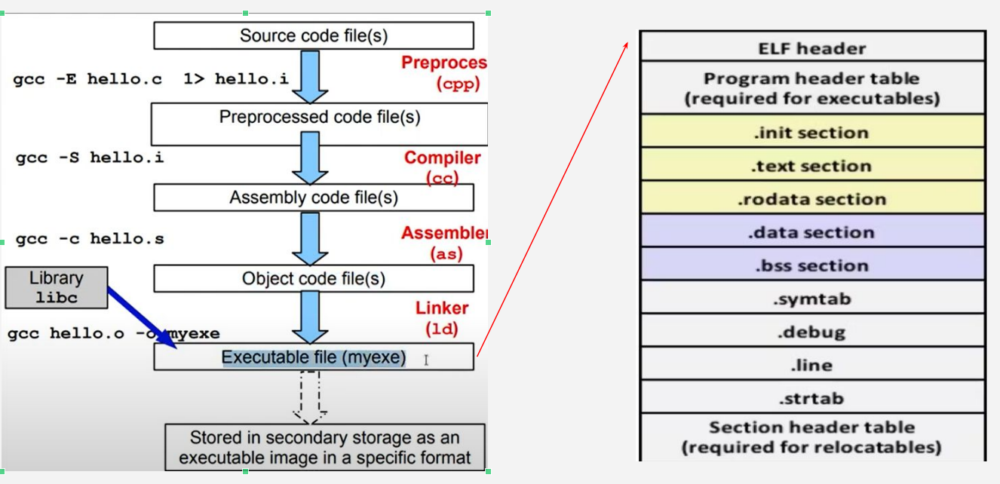
### the executable file may be .elf , .exe , .out ,.....


when the process run the first system-call run is execve 

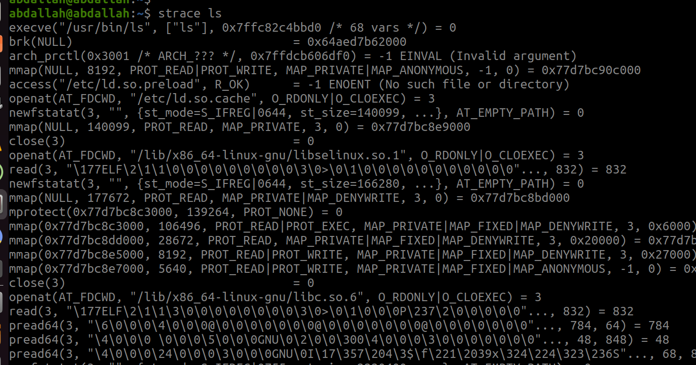


by using the loader or interpreter (/lib64/ld-linux-x86-64.so.2), it load the shared libraries 

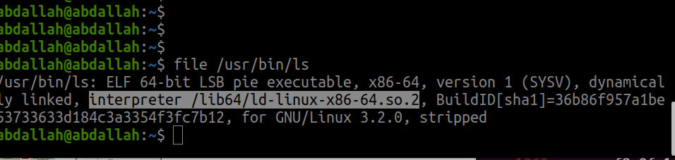


=========================================
### Headers
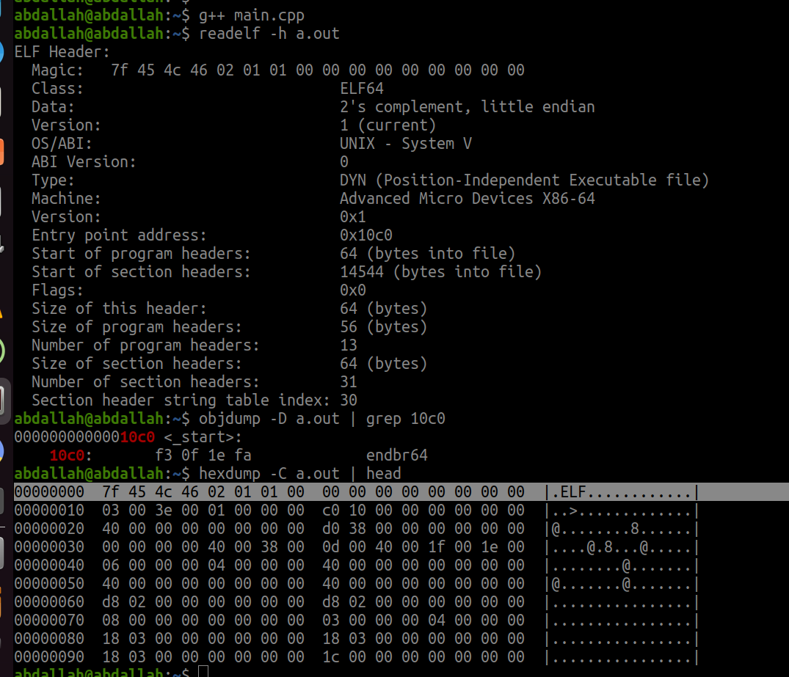


### Elf  may be dynamic or static 
### if it static that mean less system calls and more size 
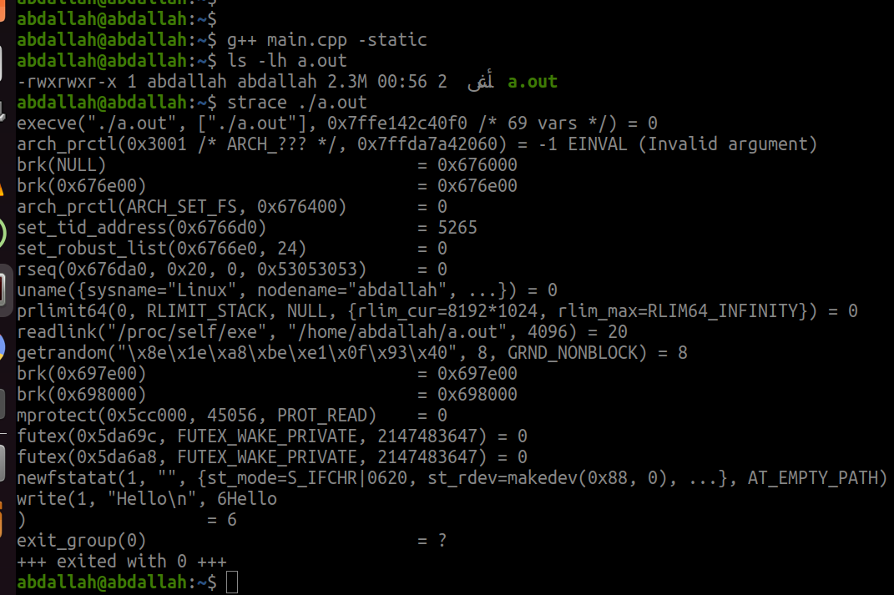
### 1.the size is 2.3 Mb
### 2.less system calls
### 3.there is no loading to the shared libraries (statically linked)

### if it dynamic that mean more system calls and less size 
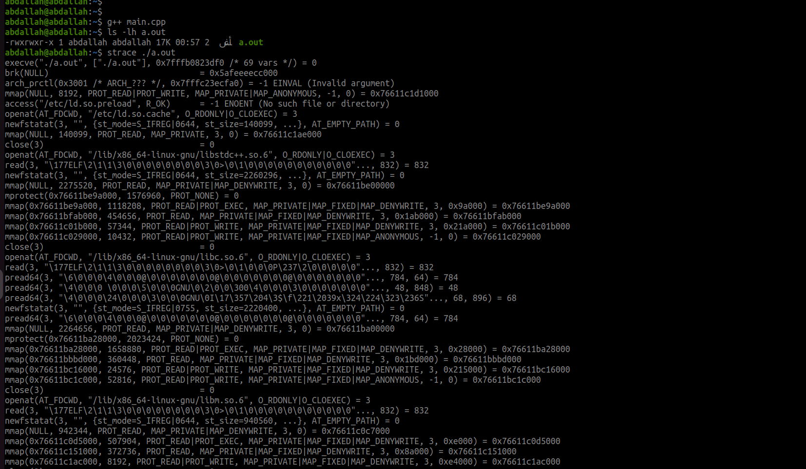

### 1.less size  17 Kb
### 2.more system calls
### 3.there is loading to the shared libraries (dynamically linked, interpreter /lib64/ld-linux-x86-64.so.2)
=========================================

## What is the dynamic linker ?

### 1.Elf needs ld-linux as dynamic Linker to load libraries 
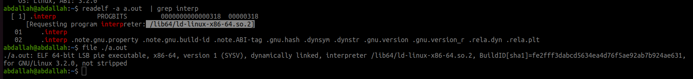


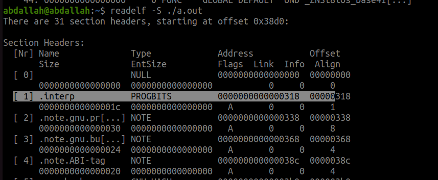

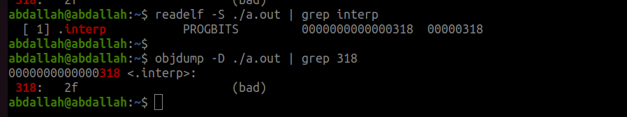

### we can pass the loader to the executable (Explicitly)
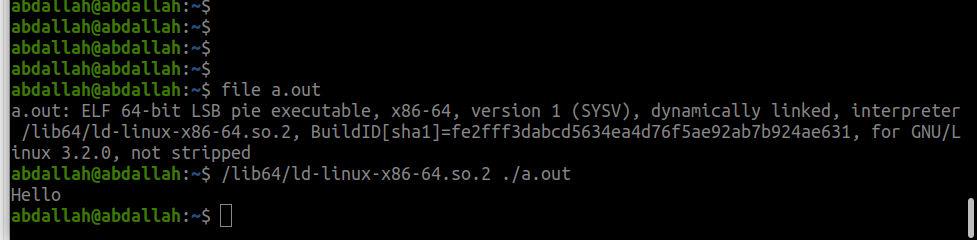


### 2.Elf file has info about what is the shared is needed ?
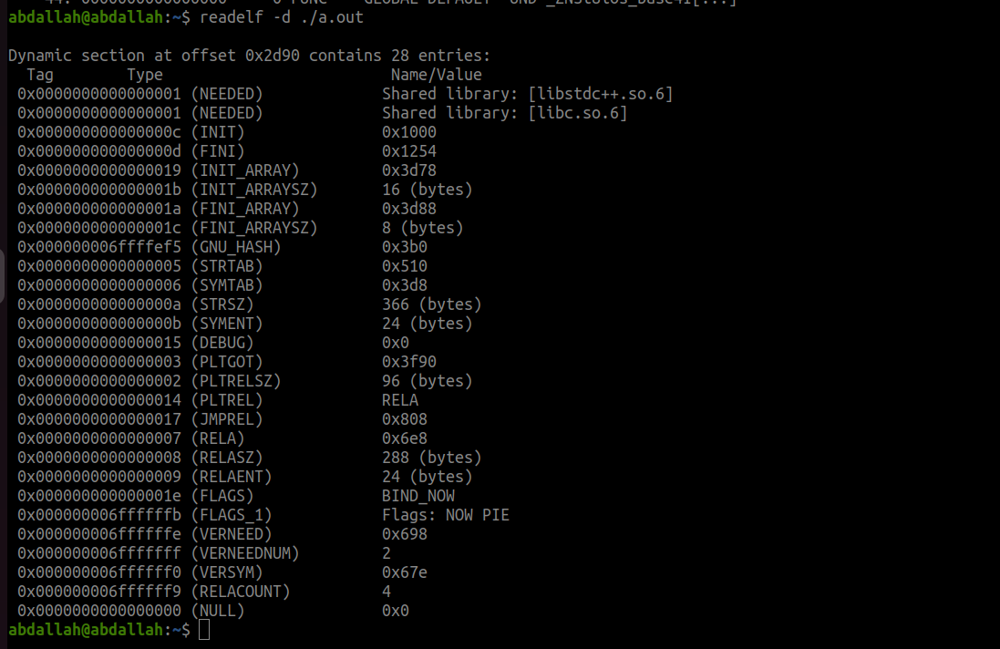


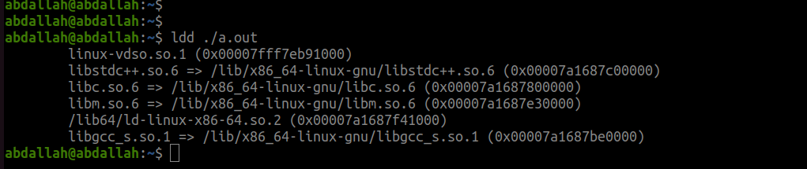

the shared libraries are (libstdc++.so.6 , libc.so.6) + the interpreter (/lib64/ld-linux-x86-64.so.2) + the gcc librarye (libgcc_s.so.1 => /lib/x86_64-linux-gnu/libgcc_s.so.1) + c++ librarye (libstdc++.so.6 => /lib/x86_64-linux-gnu/libstdc++.so.6) + (linux-vdso.so.1) and (libm.so.6)

The `linux-vdso` (Virtual Dynamic Shared Object) is a virtual library in Linux that allows certain system calls to be executed more efficiently by implementing them directly in the kernel. It is automatically mapped into the memory space of user-space processes. The `linux-vdso` library improves performance by reducing the overhead of switching between user mode and kernel mode.

The `libm.so.6` library is part of the GNU C Library (glibc), which is a core library in Linux systems. It contains a wide range of mathematical functions, such as trigonometric functions (sin, cos, tan), exponential and logarithmic functions (exp, log), and many others.

==================================================
### Summary

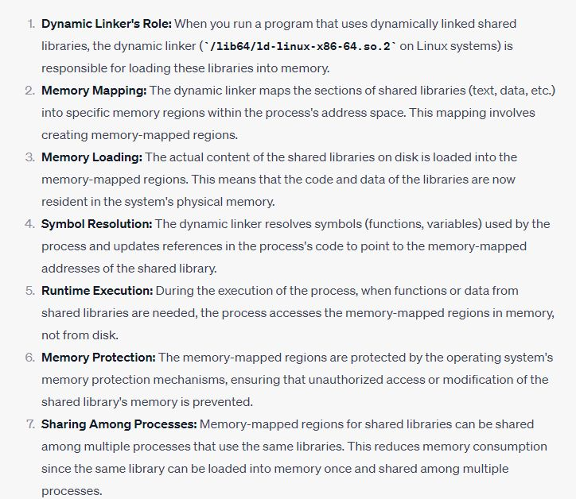


==================================================
 
## So Let's create our Bash ?

### 1.Fork system call
fork()  creates  a new process by duplicating the calling process.  The new process is referred to as the child process.  The calling process is referred to as the parent process.

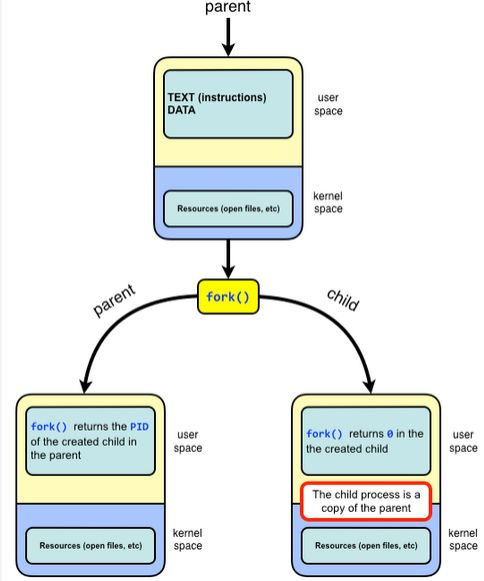

```c
#include <stdio.h>
#include <sys/types.h>
#include <unistd.h>
#include <stdlib.h>


int main(int argc, char **argv)
{
    // fork()  creates  a new process by duplicating the calling process.
    // The child has its own unique process ID,
    pid_t  child_pid;
    child_pid = fork();
    if(child_pid < 0 )
    {
        // Error occurred while creating child process
        fprintf(stderr,"Fork failed: \n");
        exit(EXIT_FAILURE);
    } 
    else if (child_pid == 0)
    {
        // this code is executed by the child process
        while(1)
        {
            printf("Child process:PID=%d , PPID=%d , GPID=%d\n", getpid(),getppid(),getgid() );
            sleep(5);
        }
    }
    else
    {
        // this code is executed by the parent process
        while(1)
        {
            printf("Parent process:PID=%d , PPID=%d , GPID=%d , ChildID=%d\n", getpid(),getppid(),getgid(),child_pid );  
            printf("==================================\n");

            sleep(5);

        }
    }
    return 0;
}
```

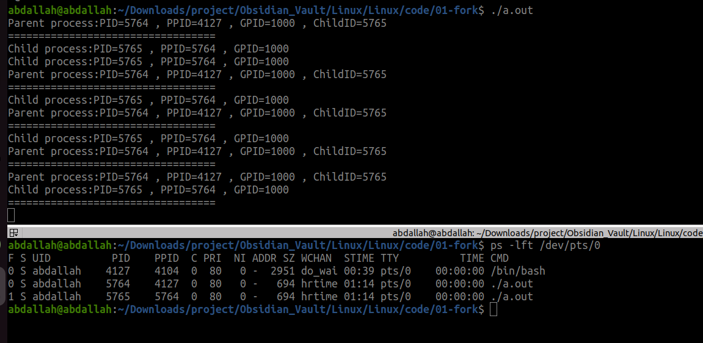
note that the parent of child process ID (PPID) is the PID of the parent process and the parent of the parent process is the bash 
### 2.execve

int execve(const char *pathname, char *const argv[],char *const envp[]);
execve() executes the program referred to by pathname.
1. pathname must be either a binary executable,
2. argv is an array of pointers to strings passed to the new program as its command-line arguments. By convention, the first of these strings (i.e., argv[0]) should contain the filename associated with the file being executed. The argv array must be terminated by a NULL pointer.(Thus, in the new program, argv[argc] will be NULL.)
3. envp is an array of pointers to strings, conventionally of the formkey=value, which are passed as the environment of the new program. The envp array must be terminated by a NULL pointer.

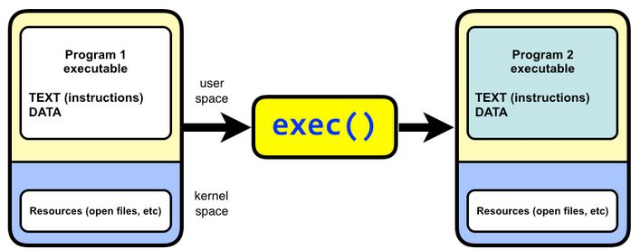

```c
#include <stdio.h>
#include <sys/types.h>
#include <unistd.h>
#include <stdlib.h>
#include <sys/wait.h>
//int execve(const char *pathname, char *const argv[],char *const envp[]);
//execve() executes the program referred to by pathname.
//pathname must be either a binary executable,
/*
        argv  is  an  array of pointers to strings passed to the new program as
       its command-line arguments.  By convention, the first of these  strings
       (i.e.,  argv[0])  should  contain the filename associated with the file
       being executed.  The argv array must be terminated by a  NULL  pointer.
       (Thus, in the new program, argv[argc] will be NULL.)
*/

/*
        envp  is  an  array  of pointers to strings, conventionally of the form
       key=value, which are passed as the environment of the new program.  The
       envp array must be terminated by a NULL pointer.
*/

int main(int argc, char **argv)
{

    char *cmd = "/usr/bin/sleep";  //pathname
    char *args[] = {cmd,"2000",NULL}; //command-line arguments
    char *envp[] = {NULL}; // the environment of the new program (optional)

    // fork()  creates  a new process by duplicating the calling process.
    // The child has its own unique process ID,
    pid_t  child_pid;
    child_pid = fork();
    if(child_pid < 0 )
    {
        // Error occurred while creating child process
        fprintf(stderr,"Fork failed: \n");
        exit(EXIT_FAILURE);
    } 
    else if (child_pid == 0)
    {
        // this code is executed by the child process
        printf("Child process:PID=%d , PPID=%d , GPID=%d\n", getpid(),getppid(),getgid() );
        execve(cmd,args,envp);
        //execve() does not return on success,
        perror("execution failed");
        exit(EXIT_FAILURE);
    }
    else
    {
        printf("Parent process:PID=%d , PPID=%d , GPID=%d , ChildID=%d\n", getpid(),getppid(),getgid(),child_pid );  
        // this code is executed by the parent process
        int status;
        waitpid(child_pid,&status,0);
        printf("the status is %d\n",status);
    }
    return 0;
}
```
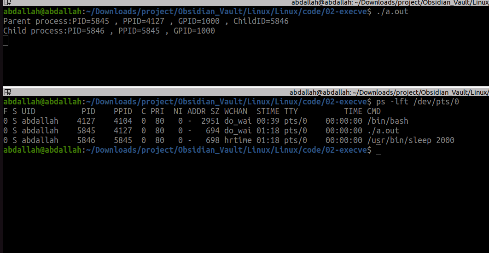

note that child process is replaced by sleep 
### ========================
### 1.Simple shell without argument


```c
#include <stdio.h>
#include <sys/types.h>
#include <unistd.h>
#include <stdlib.h>
#include <sys/wait.h>
#include <string.h>

/*
size_t strcspn(const char *s, const char *reject);
The strcspn() function returns the number of bytes in the initial segment of s which  are  not  in the string reject.
*/
#define MAX_INPUT_SIZE 100
char input[MAX_INPUT_SIZE];
int main(int argc, char **argv)
{
    while(1)
    {
        printf("SimpleShell:$ ");
        fgets(input, MAX_INPUT_SIZE,stdin);
        if(input[0] == '\n')
        {
            continue;
        }
        input[strcspn(input,"\n")] = '\0';
        if (strcmp(input,"exit") == 0 || strcmp(input,"quit") == 0 )
        {
            printf("Exiting shell ........\n");
            break;
        }

        pid_t  child_pid;
        child_pid = fork();
        if(child_pid < 0 )
        {
            fprintf(stderr,"Fork failed: \n");
            exit(EXIT_FAILURE);
        } 
        else if (child_pid == 0)
        {
            char *argc[] = {NULL};
            execvp(input,argc);
            perror("execution failed");
            exit(EXIT_FAILURE);
        }
        else
        {
            int status;
            waitpid(child_pid,&status,0);
        }

    }

    return 0;
}
```


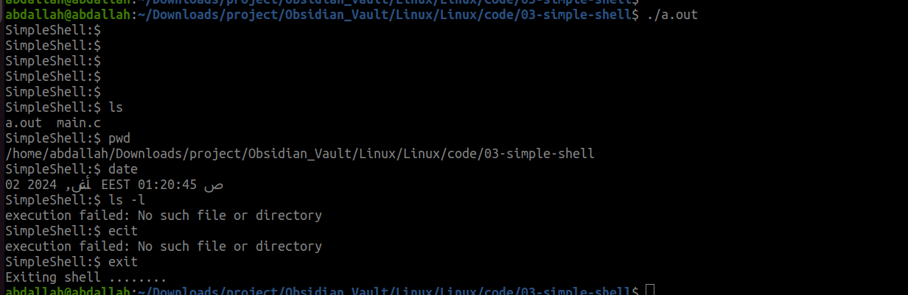

this shell not support argument
### 2.Shell with argument

```c
#include <stdio.h>
#include <sys/types.h>
#include <unistd.h>
#include <stdlib.h>
#include <sys/wait.h>
#include <string.h>
#include <libgen.h>

// task ==========================
// handle signals
//==========================
// Define macros for text color
#define ANSI_COLOR_BLACK     "\x1b[30m"
#define ANSI_COLOR_RED       "\x1b[31m"
#define ANSI_COLOR_GREEN     "\x1b[32m"
#define ANSI_COLOR_YELLOW    "\x1b[33m"
#define ANSI_COLOR_BLUE      "\x1b[34m"
#define ANSI_COLOR_MAGENTA   "\x1b[35m"
#define ANSI_COLOR_CYAN      "\x1b[36m"
#define ANSI_COLOR_WHITE     "\x1b[37m"

// Define macros for background color
#define ANSI_BG_BLACK     "\x1b[40m"
#define ANSI_BG_RED       "\x1b[41m"
#define ANSI_BG_GREEN     "\x1b[42m"
#define ANSI_BG_YELLOW    "\x1b[43m"
#define ANSI_BG_BLUE      "\x1b[44m"
#define ANSI_BG_MAGENTA   "\x1b[45m"
#define ANSI_BG_CYAN      "\x1b[46m"
#define ANSI_BG_WHITE     "\x1b[47m"

// Define macro to reset colors
#define ANSI_COLOR_RESET   "\x1b[0m"


#define MAX_INPUT_SIZE 100
char input[MAX_INPUT_SIZE];


void replaceHomeWithTilde(char *path) {
    char *home = "/home/abdallah";
    char *ptr = strstr(path, home);
    if (ptr != NULL) {
        // Replace /home/abdallah with ~
        strcpy(ptr, "~");
        strcat(ptr, ptr + strlen(home));
    }
}

#define SHORT 1
#define LONG 2

int main(int argc, char **argv)
{
    int flag = LONG;
    char cwd[1024];
    char *Basename; 
    while(1)
    {
        getcwd(cwd, sizeof(cwd)); 
        Basename = basename(cwd);
        // printf("%s",Dirname);
        replaceHomeWithTilde(cwd);
        if(flag == LONG)
        {
            printf(ANSI_COLOR_GREEN "SimpleShell:" ANSI_COLOR_CYAN "%s" ANSI_COLOR_RED ":$ " ANSI_COLOR_RESET , cwd);
        }
        else if(flag == SHORT)
        {
            printf(ANSI_COLOR_GREEN "SimpleShell:" ANSI_COLOR_CYAN "%s" ANSI_COLOR_RED ":$ " ANSI_COLOR_RESET , Basename);
        }
        fgets(input, MAX_INPUT_SIZE,stdin);
        if(input[0] == '\n')
        {
            continue;
        }
        input[strcspn(input,"\n")] = '\0';
        if (strcmp(input,"exit") == 0 || strcmp(input,"quit") == 0 )
        {
            printf("Exiting shell ........\n");
            break;
        }
        else if (strcmp(input,"short") == 0)
        {
            flag = SHORT;
            continue;
        }
        else if (strcmp(input,"long") == 0)
        {
            flag = LONG;
            continue;
        }


        char *command = strtok(input, " "); // command only
        char *args[MAX_INPUT_SIZE]; 
        int args_count = 0;
        while(command != NULL)
        {
            args[args_count++] = command;
            command = strtok(NULL," ");
        }
        args[args_count] = NULL;


        pid_t  child_pid;
        child_pid = fork();
        if(child_pid < 0 )
        {
            fprintf(stderr,"Fork failed: \n");
            exit(EXIT_FAILURE);
        } 
        else if (child_pid == 0)
        {

            execvp(args[0],args);
            perror("execution failed");
            exit(EXIT_FAILURE);
        }
        else
        {
            int status;
            waitpid(child_pid,&status,0);
        }

    }

    return 0;
}


```


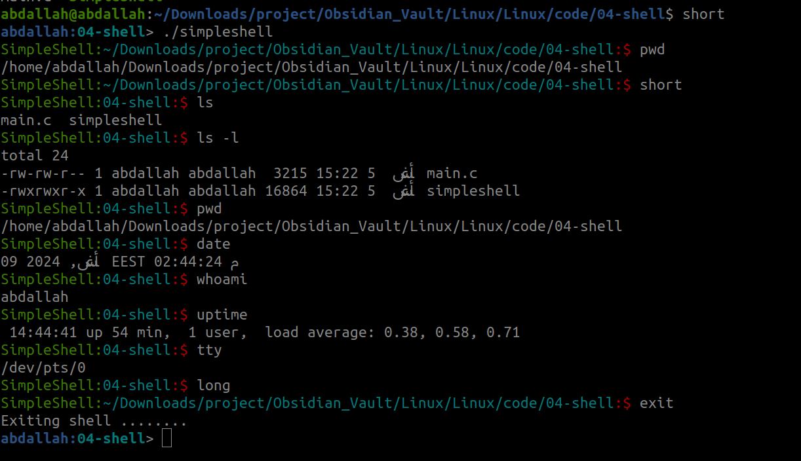


### ==========================

### what is meant by file ?
### Inode 
every file and directory has it's own directory entry contain (name , inode[pointer to i node structure]).

if it file the blocks will be a pointer to the data 
if it directory the blocks will point to the Directory entry to the content of this directory 
there is direct blocks which point direct to the data 
and indirect block if the data is very big ,it point to another block and every block has (name , inode) that point to the inode structure.
it may be single indirect , double or triple indirect .....
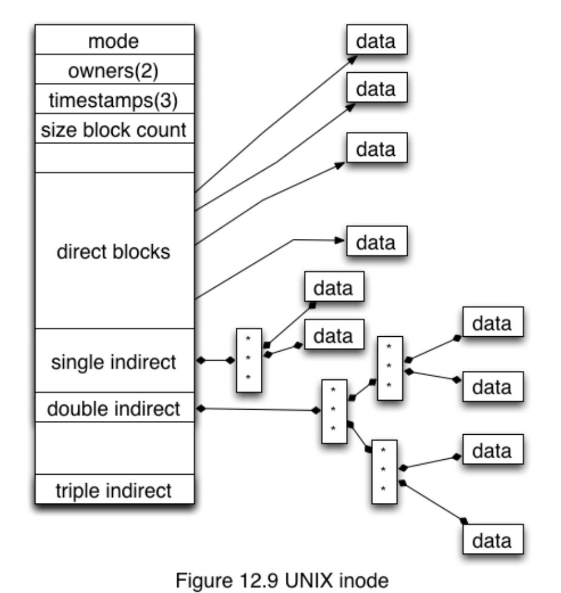


in this example we need to access the file file.txt under /foo directory 


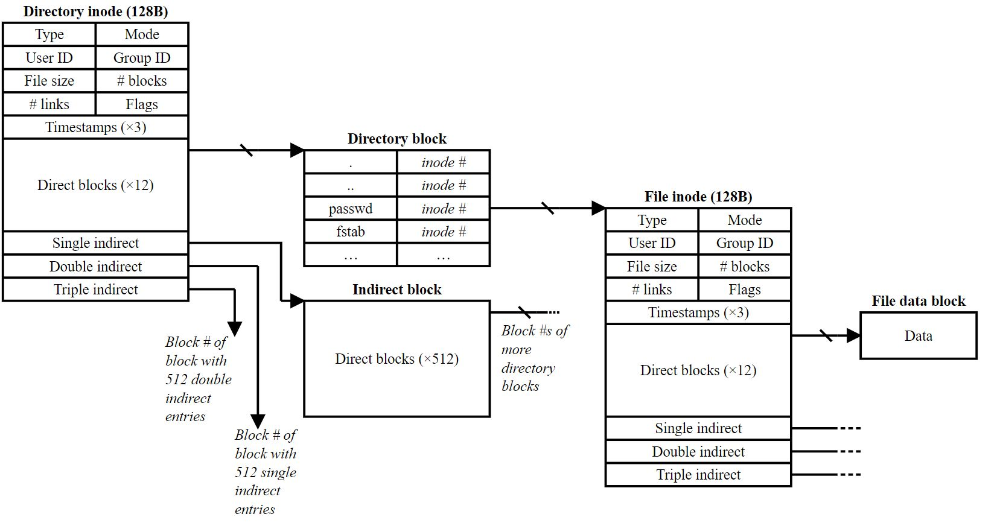

