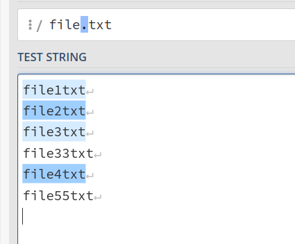
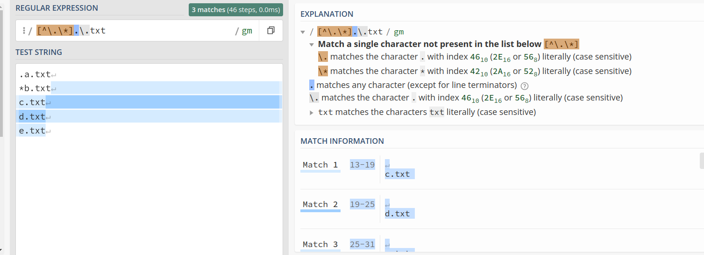
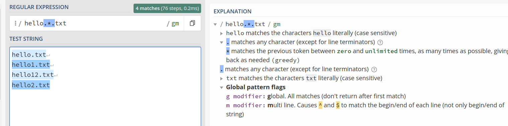
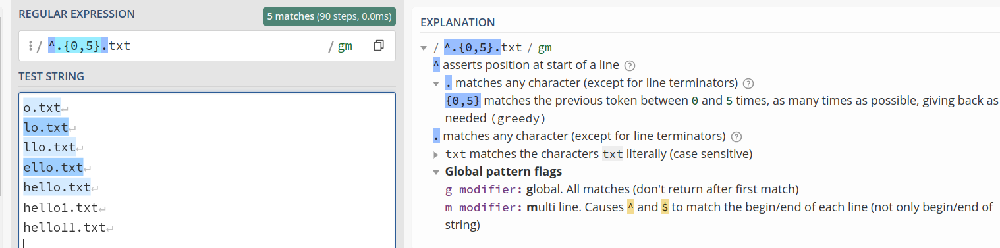
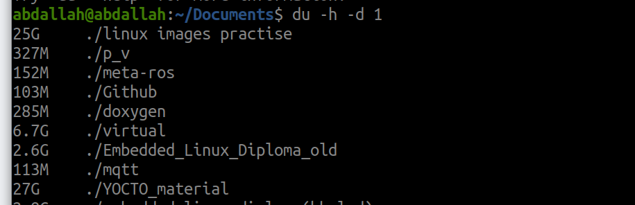

## 1.Controls(Redirection,Piping,Wildcard,regex)

### input/output streams

- **0**: Standard Input (`stdin`) - typically used for input from the keyboard or a file.
- **1**: Standard Output (`stdout`) - used for output, usually to the terminal or a file.
- **2**: Standard Error (`stderr`) - used for error messages, usually to the terminal or a file.

The file descriptor **`3`** is an additional file descriptor that your process has opened. It points to the file `/home/abdallah/file.txt`.

File descriptors beyond `0`, `1`, and `2` are used by the process to manage other files or resources that it opens. In your case:

- **3** is being used to read from `/home/abdallah/file.txt`. This might be a file opened by the process to read data from.

### 1.1 Redirection 
(>)  --> output overwrite
(>>) --> output append
(<) --> input

we can overwrite (>) the output to file.txt  or append (>>) it to file.txt

redirect output to file.txt and error to error.log

### 1.2 Piping

### 1.3 Wildcard
### 1.3.1 Asterisk (*) : represents zero or more characters.

### 1.3.2 Question Mark (?): represents a single character. 

### 1.3.3 Square Brackets [ ] and,ranges : allow you to specify a range or a set of characters for a single position in the pattern. 

### 1.3.4 Brace Expansion {} or : allows you to generate multiple strings by specifying a comma-separated list inside curly 

### 1.3.5 Exclamation Mark (!) not: can be used to negate a pattern. 

## 1.4 regular expression (regex)

### Literal Vs. Meta-Characters  
### Literal characters :- 
are those characters that represent themselves in the search pattern .
### Meta characters :- 
are those characters that have special meaning(^  $  .  [  ]  {  }  -  ?  *  +  (  )  |  \ )

==> Meta characters can be treated as literals if they are escaped, i.e. preceded by a back slash  Examples,  \^    \{   \$    \\ 
==>The back slash can also convert some of the literal characters into a meta-characters  
Examples : \d    \w 

### Types of Regular Expressions 
1. Basic Regular Expressions ==> .   ^   $   [   ]  * 
2. Extended Regular Expressions ==>  (   )   {   }   ?   +   | 
The tool ‘grep’ uses BRE 
To access ERE, use ‘egrep’ or ‘grep –E ‘ 

 
### 1.BASIC REGULAR EXPRESSIONS (BRE) 
we will use this website (regex)
https://regex101.com/r/zbD0o4/1

1.1 ANY (.) any single character (not including NULL character) 

1.2 Anchor Characters (^ , $)
The (^) mean that the string has to be at the beginning of the line 
The ($) mean that the string has to be at the end of the line 

## any empty line

1.3 Bracket Expressions []
The use of brackets for any of a set of characters listed between the brackets 

Any character inside the bracket will be considered literal except for 
(-) if it comes in the middle (will be considered as range) 

(^) if it comes at the beginning (will considered as negation) 

### Shorthand Character Classes 

### 2.EXTENDED REGULAR EXPRESSIONS (ERE) 
2.1 Alternation (|)

2.2 Quantifiers (\*,+, and ?) 
‘?’ ==> zero or one time

'\*'  ==> zero or More times

 ‘+’ ==> One or More times

1.3 Matching Count ( { ) and ( } ) 

================================
Examples
We are searching any line starting with a phone number… this can be in the format 
(nnn) nnn – nnnn OR nnn nnn-nnnn

## 2-Text Processing(sed , grep  , cut,hexdump,file)

### sed TOOL 

If the search pattern exists multiple times inside the same line, only the first occurrence will be substituted To avoid that use the global flag 

### grep 

## 3-System information(Ls family,du,/etc,/proc,who ,id, neofetch )

### Ls family

### du

### who/neofetch/id

